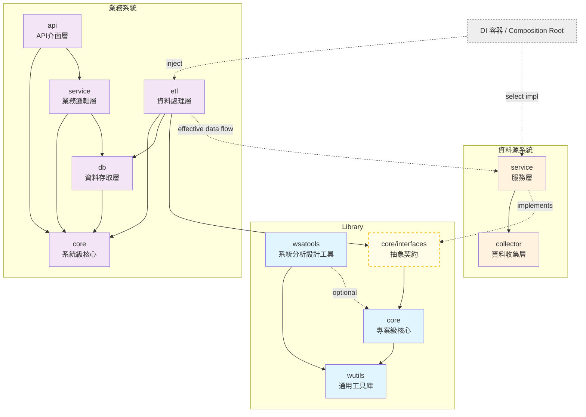
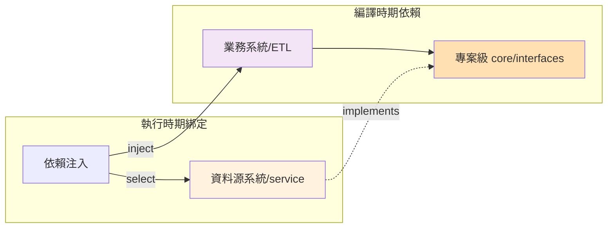
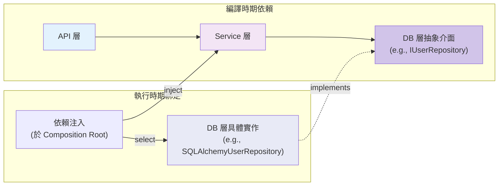

# wBiSaProj 專案設計文件 - 架構篇

## 文件定位與導覽

本文件是 wBiSaProj 專案**架構篇設計文件**，為 [總體設計文件](PROJECT_DESIGN.md) 第二部分的詳細展開。

**文件體系**：

```text
總體設計文件 (PROJECT_DESIGN.md)
    ├── 📘 架構篇 (本文件)
    ├── 📗 方法論篇 (PROJECT_DESIGN-METHODOLOGY.md)
    └── 📙 協作篇 (PROJECT_DESIGN-COLLABORATION.md)
```

**配套指引**：

- [架構實作指引](GUIDE_ARCHITECTURE.md)：具體實作範例與最佳實踐

**本文件結構**：

1. **專案架構設計**：完整描述三大系統類型的職責與組織方式
2. **系統架構依賴關係**：視覺化展示系統間的依賴關係
3. **核心組織原則**：詳細闡述以業務領域驅動結構的設計哲學與實踐方式
4. **核心架構概念**：深入說明功能單元 (FU) 與公開容器的設計理念
5. **核心開發術語**：定義專案共通的術語體系與關鍵縮寫
6. **關鍵設計原則與實踐**：詳述依賴反轉原則、混合依賴管理與資料架構原則
7. **專案檔案結構**：說明實際的目錄組織與命名規範

-----

## 架構定位：一個多系統的工作空間

在深入探討架構細節之前，必須理解 `wBiSaProj` 是一個**專案工作空間 (Workspace)**，而非單一的應用程式。本架構篇所定義的組織原則、系統類型與設計模式，是為了確保在此工作空間中開發的**每一個獨立系統（無論是業務系統、資料源系統或函式庫）**，都能遵循一致、高品質的工程標準。

-----

## 1. 專案架構設計

> 本章節完整描述三大系統類型的職責與組織方式，包括 Library、資料源系統、以及業務/應用系統的詳細架構。

專案架構在首層共分為三大類型：**Library (函式庫)**、**資料源系統**、以及**業務/應用系統**。這三種類型共同構成了工作空間的基礎。

### 1.1 Library (函式庫層)

此層級包含整個專案所有系統都可以共用的 Python 函式庫，具備高重用性。

| 函式庫 | 職責 | 依賴關係 |
|:-------|:-----|:---------|
| **`wutils`** | 提供通用的 Python 開發工具集，並作為基礎建設隔離層封裝具副作用的第三方套件 | 不依賴專案內其他任何套件 |
| **`core`** | **專案級**核心套件，提供共用基礎元件與統一抽象介面 | 依賴 `wutils` |
| **`wsatools`** | 系統分析與開發流程輔助工具 | 僅供開發時使用，不被任何系統依賴 |

#### wutils 的設計理念

wutils 作為專案依賴鏈的最底層，提供**不專屬於本專案**、在任何 Python 專案中都適用的通用工具與知識。其中一項關鍵職責是作為**基礎建設隔離層 (Infrastructure Isolation Layer)**，將具有副作用 (Side Effects) 的第三方套件封裝為穩定的內部 API。

**wutils 歸屬判斷原則（可攜性判斷）**：

判斷一項功能是否應歸入 wutils，以**可攜性 (Portability)** 為唯一基準：

> **此功能離開本專案，只要還在 Python 開發環境中，是否依舊適用？**

若答案為「是」，無論該功能看起來是否與特定業務領域（金融、統計、地理...）相關，都應歸入 wutils。

| 歸屬正確 | 歸屬錯誤 | 原因 |
|:---------|:---------|:-----|
| `wutils/finance/technical/indicators/` 中的 MA 計算 | `gms/core/` 中的 MA 計算 | MA 是金融技術分析中已確立的公式，不是 GMS 發明的，任何 Python 金融專案都適用 |
| `wutils/locale/country/` 中的 Country 定義 | `gms/core/` 中的 Country 定義 | 國家定義是真實世界的通用知識，不專屬於任何業務系統 |

**基礎建設隔離的設計理念**：

wutils 的諸多 Toolkit 中，基礎建設類（I/O、Crypto、Network、System 等）具備額外的封裝要求。其設計理念如下：

**為何需要此隔離層？**

1. **測試接縫 (Test Seam)**：上層業務邏輯測試時，只需 Mock wutils 的簡單介面，無需處理複雜的第三方套件行為，徹底解決 "Mocking Hell"。

2. **升級防火牆 (Upgrade Firewall)**：當底層套件需升級或替換時（如 `requests` → `httpx`），變更範圍被限縮於 wutils 內部，上層程式碼完全不受影響。

3. **政策集中化 (Policy Centralization)**：異常處理、重試機制、Timeout 等橫切關注點，統一在 wutils 層實作，避免各系統重複且不一致的處理邏輯。

**常見的 Toolkit 領域**（包含但不限於）：

| Toolkit 領域 | 典型功能 | 涵蓋範圍 |
|:---|:---|:---|
| **I/O** | 檔案讀寫、格式處理 | Excel, CSV, PDF, Image |
| **Crypto** | 安全性相關運算 | Hash, JWT, Encryption |
| **Network** | 網路連線與傳輸 | HTTP Client, S3, FTP |
| **System** | 系統層級操作 | OS, Environment, FileSystem |
| **Concurrency** | 並行處理封裝 | Thread, Process |
| **Time** | 時間處理與定義 | Date Formatter, Date Range, TimeZone 定義 |
| **Locale** | 地區與國際化定義 | Country, Currency, Language 定義 |
| **Text** | 文字處理 | String Sanitizer, Normalizer |
| **Math** | 通用數學與統計 | 基礎統計函數, 插值演算法 |
| **Finance** | 金融學科公式 | 技術指標 (MA, RSI), 定價模型, 風險指標 |

**第三方套件的封裝判斷原則**：

並非所有第三方套件都需要經過 wutils 封裝。判斷依據如下：

| 類別 | 定義 | 處理方式 | 範例 |
|:---|:---|:---|:---|
| **Must Wrap** | 涉及外部連線、檔案 I/O、安全性，或具高度替換風險 | **必須**透過 wutils 封裝，業務層嚴禁直接使用 | `boto3`, `requests`, `pyjwt`, `openpyxl` |
| **Allowed** | 屬於領域通用標準、純記憶體運算，且 API 極度穩定 | **允許**業務層直接使用 | `numpy`, `pandas`, `pydantic`, `decimal` |

> **判斷口訣**：若不確定某套件屬於哪類，以「**是否產生副作用 (Side Effects)**」為最終依據。若該套件的操作會改變系統狀態、進行網路傳輸或磁碟 I/O，則必須封裝。
>
> 關於封裝的實作規範（如封裝厚度標準、例外情境），請參閱本文件 §6.7「第三方套件依賴策略」。

#### core 套件的角色

> **關鍵理解**
>
> - 提供所有系統橫跨共用的基礎元件（schemas、constants）
> - 定義統一的抽象介面（Repository Pattern）
> - 作為業務系統與資料源系統之間解耦的契約

### 1.2 資料源系統 (Data Source Systems)

此類型系統為**專案內部開發的適配器 (Adapter)**，其核心職責是**存取並封裝一個外部資料源** (例如：第三方 API、網路爬蟲、外部資料庫)。它對內提供標準化、唯讀的數據服務，是專案中使用外部數據的統一入口。

#### 資料源分類

根據**存取方式**的不同，本專案將資料源明確分為兩大類：

| 類型 | 定義 | 存取方式 |
|:-----|:-----|:---------|
| **內部資料源** | 公司內部資料庫 | 透過資料庫連線（如 SQL）直接存取 |
| **外部資料源** | 需透過應用層介面存取的資料 | RESTful API 或網路爬蟲 |

> 注意：此分類與系統是否在公司內部無關，而是取決於其存取協定

#### 標準兩層架構

不論來源為何，所有資料源系統都採用標準的兩層架構進行封裝：

| 層級 | 名稱 | 職責 | 內部資料源處理 | 外部資料源處理 |
|:-----|:-----|:-----|:---------------|:---------------|
| **第一層** | `<system>/collector` | 資料收集層 | 執行 SQL 查詢<br>回傳原始結果 | 處理 HTTP 請求<br>回傳原始響應 |
| **第二層** | `<system>/service` | 服務層 | 格式標準化<br>資料驗證 | 資料解析（JSON/HTML）<br>格式標準化<br>快取處理 |

### 1.3 業務/應用系統 (Business/Application Systems)

此類型系統是專案的核心價值所在，負責實現具體的業務功能。其內部雖然包含五個標準子模組，但在概念上可以清晰地劃分為三大職責區塊：

#### A. 系統級共用核心

| 模組 | 職責 | 特點 |
|:-----|:-----|:-----|
| **`<system>/core`** | 系統內部的共享函式庫 | 封裝系統內各模組都會共用的元件 |

#### B. 批次資料處理流程

| 模組 | 職責 | 特點 |
|:-----|:-----|:-----|
| **`<system>/etl`** | 資料抽取、轉換與載入 | 透過 `core` 定義的抽象介面從資料源獲取資料<br>將處理完成的資料寫入自身的 `db` 層 |

#### C. 線上應用三層式架構

這是提供即時服務的標準應用架構，由以下三層構成：

| 層級 | 模組 | 角色 | 職責 |
|:-----|:-----|:-----|:-----|
| **表現層** | `<system>/api` | Presentation Layer | 提供 RESTful API<br>處理 HTTP 請求 |
| **邏輯層** | `<system>/service` | Business Logic Layer | 實作業務規則<br>編排協調 db 層功能 |
| **資料層** | `<system>/db` | Persistence Layer | 封裝資料庫操作<br>提供資料存取介面 |

> **實作參考**
>
> 關於三層式架構的具體實作範例，包括 Repository Pattern、Service 層的業務編排模式、以及 API 層的設計模式，請參閱配套的 [架構實作指引](GUIDE_ARCHITECTURE.md)。

-----

## 2. 系統架構依賴關係

在定義了工作空間的三大系統類型後，本章節展示它們之間的標準依賴關係，這是實現「高內聚、低耦合」的關鍵藍圖。

### 2.1 系統架構依賴關係圖

以下圖表展示了 wBiSaProj 專案中各系統類型之間的依賴關係：

**圖 1：wBiSaProj 系統架構依賴關係**



### 2.2 依賴關係說明

**核心原則：依賴反轉 (DIP)**

本圖最重要的概念是**業務系統與資料源系統之間的解耦**：

- **編譯時期**：`etl` 層只依賴定義在 `core/interfaces` 中的**抽象契約**
- **執行時期**：具體的 `ds_service` 實例透過**依賴注入 (DI) 容器**動態提供給 `etl` 層
- **效果**：新增資料源無需修改任何業務系統程式碼

> **關鍵理解：依賴反轉的實踐**
>
> - 編譯時：業務系統的 ETL 層只認識 `core/interfaces` 中的抽象介面
> - 執行時：透過 DI 容器注入具體的資料源實作
> - 架構紅線：任何違反此原則的直接依賴都將破壞系統的解耦設計

**其他依賴規則**：

- 所有系統的所有模組都可依賴 `wutils` 和專案級 `core`（為簡化圖面，這些依賴線已省略）
- `wsatools` 為開發輔助工具，不被任何其他系統依賴
- 業務系統之間僅能透過 API 層互相通訊（圖中未顯示）

-----

## 3. 核心組織原則：以業務領域 (Domain) 驅動結構

> 本章節深入闡述總體設計文件中「領域驅動」原則的具體定義與實踐方式。這是理解本專案所有結構化設計的基礎。

在了解了工作空間的整體藍圖（系統類型與依賴）後，我們接著深入探討**系統內部**（特別是業務系統與資料源系統）的組織哲學。

本專案架構的核心組織原則，是一個**由下而上 (Bottom-up)** 的業務領域**聚合 (Aggregation)** 過程。我們透過對系統中既有的、具體的業務領域進行歸納與組織，從而精準映射真實世界的商業邏輯。`Domain` 的劃分必須由業務需求驅動，而非技術實現的便利性。

### 3.1 指導原則一：業務領域優先於技術概念

`Domain` 與 `Sub-Domain` 的命名與層次結構，必須反映業務本身的邏輯結構。它們代表了系統的**核心業務範疇**（例如：使用者管理、市場分析），而不應是**技術實現的概念**（例如：身份認證、資料庫連接器）。

#### 判斷指引：功能歸屬的實例分析

**情境**：開發「使用者註冊」相關功能

❌ **錯誤歸類**：`identity` (身份認證) Domain

- **原因**：`identity` 描述的是「如何實現」的技術手段，而非「需要管理什麼」的業務領域

✅ **正確歸類**：`User` Domain

- **原因**：`User` (使用者) 是系統需要直接面對和管理的核心業務對象，是一個穩定且公認的業務領域

### 3.2 指導原則二：由具體到抽象，聚合共通概念

系統的結構並非由上而下的細分，而是隨著對業務理解的加深而演化。

1. **起點：具體的業務領域**

   - 系統最初是由一系列獨立、平級的具體業務領域所構成
   - 例如：金融系統初期可能包含 `user` (使用者)、`stock` (股票)、`fund` (基金) 等核心領域
   - 在初始階段，這些都是獨立的業務領域

2. **演化：共通概念的識別**

   - 當我們識別出某些業務領域之間存在一個共通的、範圍更大的業務概念時
   - 這個共通概念就會被確立為一個更高層次的 `Domain`
   - 例如：我們意識到 `stock` 和 `fund` 都可被歸納於「市場 (`market`)」這個共通概念之下

3. **重組：Domain 與 Sub-Domain 的確立**

   - 一旦 `market` 這個聚合型的 `Domain` 被確立
   - 原先的 `stock` 和 `fund` 領域，其角色就轉變為隸屬於 `market` 的 `Sub-Domain`
   - 而像 `user` 這樣不具備此共通概念的領域，則繼續維持其作為一個獨立 `Domain` 的地位

> **關鍵理解：Domain 與 Sub-Domain 的演化**
>
> - Domain 結構是**演化**而來，而非預先設計
> - 共通概念的識別驅動了層次結構的形成
> - 結構的調整應基於業務理解的深化

### 3.3 結構定義與規則

`Domain` 與 `Sub-Domain` **都是**系統中具體且真實的業務領域，是承載業務價值的基本單位。它們的區別在於其組織結構中的角色：

**結構定義**：

| 概念 | 定義 | 角色 |
|:-----|:-----|:-----|
| **Sub-Domain** | 隸屬於某個更高階 Domain 概念之下的具體業務領域 | 與其他 Sub-Domain 共享共通的業務上下文 |
| **Domain** | 系統中的業務領域概念 | 1. 獨立的、自成一體的具體業務領域 (如 `user`)<br>2. 聚合了多個相關 Sub-Domain 的高階業務概念 (如 `market`) |

**關鍵規則**：

- 一個聚合型的 `Domain` 之下，必須包含**至少兩個** `Sub-Domain`，否則這個組織層級便失去意義
- 若一個系統在可預見的未來都只會服務於單一的業務領域，則可省略 `domain` 層級的目錄，系統本身即被視為一個獨立的 Domain

#### 領域概念的適用範圍

「領域驅動」的核心原則主要應用於**業務/應用系統**的結構組織。

然而，對於結構較為複雜的**資料源系統**，同樣可以採用 Domain/Sub-domain 的概念進行內部劃分。例如，一個提供金融數據的資料源系統，其內部可劃分為 `market` (市場行情)、`finance` (公司財報) 等不同領域。

若資料源系統功能單一，則可將其整體視為一個獨立的 Domain。

### 3.4 Feature 的歸屬原則

一個 `Feature` 的歸屬，取決於其所在的系統類型，這定義了該 Feature 的核心上下文：

- **業務/資料源系統中的 Feature**：必須歸類到其核心價值所屬的 `Domain` 或 `Sub-Domain` 之下。這定義了 Feature 的**業務上下文 (Business Context)**。
- **函式庫中的 Feature**：必須歸類到其功能所屬的 `Toolkit` 之下。這定義了 Feature 的**技術上下文 (Technical Context)**。

### 3.5 資料重力與歸屬原則 (Data Gravity & Ownership Principles)

在決定一個 Feature 或資料實體 (Entity) 的 Domain 歸屬時，除了直觀的業務語意，必須遵循物理層面的 **「資料重力 (Data Gravity)」** 原則。

**核心原則**：
資料應歸屬於**其描述的核心實體 (Core Entity)**，而非**使用它的發起者 (Initiator)**。

**判斷指引**：
當一個資料實體 (e.g., `Watchlist`) 屬於某個擁有者 (e.g., `User`)，但其業務價值高度依賴與另一個 Domain (e.g., `Market`) 的核心數據進行高頻關聯 (Join) 或計算時：

- ❌ **直觀歸屬 (基於擁有者)**：放在 `User` Domain。
    - *後果*：導致跨服務/跨庫的高頻 Join，效能低落且依賴關係混亂。
- ✅ **重力歸屬 (基於資料親和性)**：放在 `Market` Domain。
    - *效益*：資料與其依賴的源頭位於同一邊界內，實現高效能與高內聚。

**口訣**：

- **Entity Identity (你是誰)** -> 歸屬 `User` / `Identity` Domain。
- **Financial Context (你在看什麼商品)** -> 歸屬 `Market` Domain (即使是你的私有清單)。

-----

## 4. 核心架構概念：功能單元 (Functional Unit) 與公開容器 (Public Container)

> 本章節說明專案的核心程式碼組織模式，即如何透過「功能單元」與「公開容器」實現程式碼的高內聚與封裝。

在定義了系統的業務領域組織原則後，我們進一步探討如何在程式碼層級實現高品質的模組化架構。

### 4.1 功能單元 (Functional Unit, FU)

功能單元 (FU) 是本專案**最小的邏輯完整性單位**。每個 FU 都是一個自成一體的功能塊，具有明確的職責、介面和測試。

從概念上講，一個完整的功能單元 (FU) 由以下三部分構成：

1. **規格文件 (Specification)**：定義功能的需求、介面與行為。
2. **功能實作 (Implementation)**：實現規格中定義的功能。
3. **測試程式 (Tests)**：驗證實作是否符合規格。

> **重要：概念 vs. 實體位置**
>
> 雖然一個 FU 在概念上包含上述三者，但它們的**實體檔案存放位置**是分離的，以保持專案根目錄的清晰。
>
> 關於這三部分如何對應到具體檔案路徑的權威性定義，請**嚴格遵循 [Section 5.4 結構對應性原則](#54-結構對應性原則)** 的規範。

### 4.2 公開容器 (Public Container)

公開容器是功能單元的**承載者**與**組織者**，它定義了功能的可見性邊界。

**核心特徵**：

1. **命名規則**：不以底線開頭的 Python 套件
2. **公開介面**：透過 `__init__.py` 明確定義對外暴露的 API
3. **封裝邊界**：所有私有實作（`_*` 開頭）都被封裝在容器內部

**層次結構示例 (依模組類型區分)**：

此範例展示了「公開容器」(`<fu_path>`) 內部的實作結構。

#### 範例 1：函式庫 (Library) 的 FU-Container

(例如: `<fu_path>` = `core/config`)

此 Container 提供一個 Environment Management FU，包含了兩個公開函數 `get_env` 與 `set_env`。

```text
core/config/
├── __init__.py       # 公開介面：匯出 get_env, set_env
│
├── _environment.py   # Environment Management FU 的私有實作
└── ...
```

#### 範例 2：業務系統 (Business System) 的 FU-Container

(例如: `<fu_path>` = `gms/db/user/profile`)

此 Container **對外提供** Repository 操作介面與 Domain Schemas (Pydantic)；其**內部實作**則封裝了 ORM 模型、DTO 定義與具體的資料存取邏輯。

```text
gms/db/user/profile/
├── __init__.py       # 公開介面：匯出 UserProfileRepository 與 UserProfileSchema
├── _imports.py       # 此模組的統一依賴入口
├── _common/          # 此模組內部共用的私有元件
│   └── constants.py
├── _schemas.py       # Pydantic Domain Schemas (公開契約，包含 Input/Output 定義)
├── _models.py        # SQL ORM 模型定義 (Private implementation)
├── _dtos.py          # FileSystem/NoSQL 資料傳輸物件定義 (Private implementation)
├── _repository.py    # 負責協調 SQL 與 FS 的倉儲邏輯
└── ...
```

> **關鍵理解：封裝、對應與實作**
>
> 1. **封裝 (Encapsulation)**：
>
>    - 上述所有 `_` 開頭的檔案或目錄（如 `_environment.py`、`_common/`、`_models.py`）均為**私有實作**。外部模組**嚴禁**直接導入它們。
>    - `__init__.py` 是唯一的公開入口。
>
> 2. **FU 實作 (FU Implementation)**：
>
>    - 一個 FU 可能分佈在多個私有檔案中；一個私有檔案也可能包含多個 FU 的實作。
>
> 3. **特殊機制 (註)**：
>
>    - **函式庫 (Library)** 通常結構較為單純。
>    - **業務系統**則會根據其所在的層級，引入 `_imports.py` 或 `_common/` 等特定的組織模式，請參考 [Section 6.3 `_imports.py` 混合依賴管理機制](#63-_importspy-混合依賴管理機制)。
>
> 4. **對應 (Correspondence)**：
>
>    - 此範例僅展示**功能實作**的結構。
>    - 相關的規格 (`docs/specs/.../<fu_path>/...`) 和測試 (`tests/.../<fu_path>/...`) 的具體位置，請**嚴格遵循 [Section 5.4 結構對應性原則](#54-結構對應性原則)** 的規範。

-----

## 5. 核心開發術語

本章節定義專案中的核心術語體系，確保團隊溝通的一致性。

### 5.1 系統類型術語

| 術語 | 定義 | 範例 |
|:-----|:-----|:-----|
| **Library** | 跨系統共用的函式庫 | `wutils`, `core`, `wsatools` |
| **Data Source System** | 封裝外部資料源的適配器系統 | `tej`, `yafin` |
| **Business System** | 實現業務邏輯的應用系統 | `gms`, `tps` |

### 5.2 架構層次術語

| 術語 | 定義 | 說明 |
|:-----|:-----|:-----|
| **Domain** | 業務領域 | 系統中的核心業務範疇 |
| **Sub-Domain** | 子業務領域 | 隸屬於某個 Domain 的具體業務領域 |
| **Feature** | 功能特性 | **可獨立交付的業務價值或技術能力單元** (包含 Use Cases 與對應的 Task 實作) |
| **Toolkit** | 工具集 | Library 中的功能分類單位 |

### 5.3 專案核心變數定義 (Project Core Variable Definitions)

以下術語用於文件中描述路徑與命名規範：

| 變數 | 定義 | 範例 |
| :--- | :--- | :--- |
| **`<system>`** | 業務系統或資料源系統的名稱 | `gms`, `tej` |
| **`<business_system>`** | 專案內的業務系統 | `gms` |
| **`<datasource_system>`** | 專案內的資料源系統 | `tej` |
| **`<library>`** | 專案級共用函式庫或系統級內部核心模組 | `core`, `wutils`, `<system>/core` (e.g., `gms/core`) |
| **`<toolkit>`** | 函式庫的功能分類（技術解決方案集合） | `io`, `security/crypto`, `time/ranger` |
| **`<domain>`** | 系統的業務領域分類（業務範疇） | `user`, `market` |
| **`<subdomain>`** | 隸屬於 Domain 之下的具體業務範疇 | `stock`, `profile` |
| **`<feature_name>`** | **業務價值或技術能力的交付單位名稱** (須涵蓋完整聚合能力) | `excel-processing`, `user-registration` |
| **`<fu_path>`** | FU Container 相對於專案根目錄的完整路徑 | `wutils/io`, `gms/db/user` |
| **`<fu_name>`** | 具體功能單元 (FU) 的邏輯名稱（目錄友善格式） | `pickle-io`, `date-parser` |
| **`<impl_file>`** | 私有實作檔案的相對路徑與檔名（相對於 `<fu_path>`） | `_pickle.py`, `_impl/_parser.py` |

> **規範要點**（僅針對 §5.3 定義之專案核心變數）：
> 1. **命名限制**：`<toolkit>` 必須反映具體技術領域，**禁止**使用 `common`, `general` 等模糊字眼。
> 2. **Feature 命名限制**：`<feature_name>` 必須描述 Feature 的 **完整交付能力**。若 Feature 包含成對的邏輯 (e.g., Reader/Writer)，名稱必須涵蓋兩者 (e.g., `processing` 或 `io`)，**禁止**使用單一 FU 名稱 (e.g., `reader`) 代表整個 Feature。
> 3. **格式限制**：佔位符內部的變數名統一使用 **`snake_case`**。
> 4. **路徑限制**：嚴禁在尖括號 `<>` 內部包含實體路徑符號...
>
> *註：一般性提示（如 `ExportedClass`, `exported_function`）不受此格式約束，僅用於開發意圖示意。*

### 5.4 佔位符符號規範 (Placeholder Syntax)

| 符號格式 | 語義定義 | 範例 |
| :--- | :--- | :--- |
| **`<variable_name>`** | **強制變數**：代表此處必須根據實際內容代換。 | `<fu_name>`, `<system>` |
| **`[ ... ]`** | **選填項目**：代表此層級或內容在某些情境下可省略。 | `[<subdomain>]` |

> **規範要點**（僅針對 §5.3 定義之專案核心變數）：
> 1. 佔位符內部的變數名統一使用 **`snake_case`**。
> 2. 嚴禁在尖括號 `<>` 內部包含實體路徑符號（如前導底線 `_` 或副檔名 `.py`）。
>
> *註：一般性提示（如 `ExportedClass`, `exported_function`）不受此格式約束，僅用於開發意圖示意。*

### 5.5 導入轉換規則 (Import Transformation Rules)

> 為了保持技術規格文件 (Specs) 的簡潔，文件統一使用實體路徑變數。在轉換為 Python 程式碼時，遵循以下轉換邏輯：
> 1. **外部導入 (External Import)**：
> - **適用變數**：`<fu_path>`
> - **規則**：將路徑中的 `/` 替換為 `.`。
> - **範例**：`from <fu_path> import ...` → `from wutils.io import ...`
>
> 2. **內部導入 (Internal Import)**：
> - **適用變數**：`<impl_file>`（相對於 `<fu_path>` 的路徑）
> - **規則**：移除 `.py` 副檔名，將 `/` 替換為 `.`，並加上相對導入前綴 `.`。
> - **範例**：`from .<impl_file> import ...` → `from ._pickle import ...` 或 `from ._pandas._pickle import ...`

### 5.6 結構對應性原則

> **關鍵理解：結構對應性原則 (Structural Correspondence Principle)**
>
> 「結構對應性原則」是確保專案宏觀結構一致性的關鍵機制。此原則的核心是，所有與某個功能單元容器 (`FU Container`) 相關的規格、測試與實作，都必須存放在以該容器路徑 (`<fu_path>`) 為基礎的對應目錄結構中。
>
> 在此原則下，我們採用一種**混合式對應模型**：

**1. 技術規格 (Specification)**

- **路徑**：`docs/specs/<fu_path>/<fu_name>/...`
- **角色**：規格文件是**真理的唯一來源 (Single Source of Truth)**。它不僅定義了功能，**還必須明確記載其對應的測試與功能實作的實際路徑**，作為開發導航的地圖。

**2. 測試程式 (Tests)**

- **路徑**：`tests/<fu_path>/<fu_name>/...`
- **角色**：測試的目錄結構與規格文件完全對應，確保了從邏輯單元到其驗證程式碼的直接可追溯性。

**3. 功能實作 (Implementation)**

- **路徑**：`<fu_path>/_*/...`
- **角色**：功能實作被封裝在 `<fu_path>` 下的任意私有模組或套件中（以 `_` 開頭）。其命名和內部結構無需與 `<fu_name>` 強制對應，給予了開發最大的彈性。

**4. 功能導入 (Usage)**

- **語法**：`from <fu_path> import ...`
- **角色**：`<fu_path>` 是功能的**唯一公開入口**。所有外部模組都必須透過此路徑導入所需的功能，嚴格禁止穿透容器直接導入其內部的私有實作 (`_*`)。

> 這種模型讓開發者可以清晰地從 `<fu_name>` 找到其規格與測試，再透過閱讀規格文件精準定位到功能實作，並最終透過 `<fu_path>` 安全地使用該功能。

### 5.7 關鍵技術縮寫

| 縮寫 | 全稱 | 中文說明 |
|:-----|:-----|:---------|
| **DIP** | Dependency Inversion Principle | 依賴反轉原則 - 高層模組不依賴低層模組，兩者都依賴抽象 |
| **DI** | Dependency Injection | 依賴注入 - 在執行時期動態提供依賴的技術 |
| **FU** | Functional Unit | 功能單元 - 專案中最小的邏輯完整性單位 |
| **ETL** | Extract, Transform, Load | 資料抽取、轉換與載入 |
| **API** | Application Programming Interface | 應用程式介面 |
| **ORM** | Object-Relational Mapping | 物件關聯對映 |

-----

## 6. 關鍵設計原則與實踐

為確保專案的穩定性、可擴展性與長期可維護性，所有開發活動均需遵循以下關鍵設計原則。

### 6.1 基礎設計原則

| 原則 | 說明 |
|:-----|:-----|
| **系統間通訊** | 業務系統之間僅能透過 API 進行通訊，嚴格禁止直接存取其他系統的資料庫 |
| **資料庫策略** | 每個業務系統擁有獨立資料庫，可混合使用 SQL、NoSQL 與檔案系統儲存 |
| **資料存取技術選型** | 資料源系統使用直接 SQL；業務系統 DB 層使用 ORM；ETL 層視資料量選擇 |
| **命名空間區分** | 專案級：`from core import ...`<br>系統級：`from <system>.core import ...` |

### 6.2 依賴反轉原則 (Dependency Inversion Principle)

此原則是本專案的**架構紅線**，旨在達成系統間與系統內的高度解耦。

#### ⚠️ 架構紅線：禁止直接耦合

**跨系統規則**：

- 🚫 嚴格禁止直接 `import` 其他系統的具體實作（例如：`from tej.service import ...`）
- ✅ 必須透過專案級 `core/interfaces` 的抽象介面

**跨 Domain 規則**：

- 🚫 禁止 Domain 之間直接依賴彼此的具體實作
- ✅ 必須透過系統級 `<system>/core/interfaces` 的抽象介面或各層定義的介面

#### ⚠️ 架構紅線：禁止業務邏輯層直接存取資料源

**原則**：
業務系統的 Service 層 (`<system>/service`) 與 API 層 (`<system>/api`) **嚴禁** 直接依賴或使用資料源介面 (如 `core/interfaces` 中的 `IStockPriceProvider`)。

**規範**：

- **資料自主性**：業務系統的所有資料獲取，**必須且只能** 透過其專屬的 Repository (如 `IStockPriceRepository`) 進行，存取已經落地於內部資料庫的資料。
- **職責分離**：Service 層專注於業務邏輯分析，不應處理外部資料源的不穩定性或延遲。

**例外**：

- 資料源介面 **僅允許** 由 **ETL 層** (`<system>/etl`) 在執行資料同步作業時使用。ETL 層是資料源在業務系統中唯一的合法消費者。

#### 系統間依賴反轉 (Inter-System DIP)

此模式應用於業務系統與資料源系統之間，確保業務邏輯不依賴具體的資料來源。



**關鍵點**：

- 編譯時期：`ETL` 層只認識定義在專案級 `core` 的介面
- 執行時期：透過 DI 容器注入具體的 `DataSource` 實作
- **優點**：新增資料源系統完全無需修改既有的 `ETL` 程式碼

#### 系統內依賴反轉 (Intra-System DIP)

此模式應用於單一業務系統內部各層之間，確保高層策略不依賴低層實現。



**關鍵點**：

- 編譯時期：`Service` 層只認識 `DB` 層的抽象介面
- 執行時期：在應用程式入口（Composition Root）組裝所有具體實作
- **優點**：儲存技術變更時，無需修改 `Service` 層或 `API` 層程式碼

> **實作參考**
>
> 關於依賴反轉原則在 Python 專案中的具體實踐，包括使用 FastAPI 框架實現 Composition Root、依賴注入容器的設計，以及跨系統介面的實作範例，請參閱 [架構實作指引](GUIDE_ARCHITECTURE.md)。

### 6.3 `_imports.py` 混合依賴管理機制

「業務/應用系統」相較於「資料源系統」或「函式庫」有更為複雜的路徑結構與依賴關係，為解決 Python 中因目錄結構變更而導致的 `import` 路徑脆弱問題（例如 `from ....module import ...`），並嚴格管理**業務/應用系統**內部的複雜依賴，本專案導入一套混合依賴管理機制。

#### 核心目的：統一依賴入口

此機制的**核心目的**是，為業務/應用系統」的四大標準模組（`api`, `service`, `db`, `etl`）各自建立一個**統一的依賴管理入口**。

這套機制旨在解決**兩種**維護性難題：

1. **管理內部依賴（相對導入）**：

   - **問題**：模組內部（例如 `api` 模組）的子模組間使用相對導入（`from .. import ...`），當 `api` 模組*內部*結構重構時，這些相對路徑需要大量修改。
   - **解決**：`_imports.py` 統一管理這些內部的相對導入。

2. **管理外部依賴（絕對導入）**：

   - **問題**：模組（例如 `service` 模組）的多處程式碼都依賴*外部*模組（例如 `<system>/core`）。當 `core` 模組的結構發生變化時，`service` 模組內所有引用到該依賴的地方都需要修改。
   - **解決**：由 `service` 模組的根 `_imports.py` 統一負責導入 `core` 的依賴，`service` 內部的程式碼再從 `_imports.py` 獲取此依賴。

透過此機制，四大模組各自的 `_imports.py` 成為了該模組的「依賴抽象層」，極大地降低了因結構變動帶來的維護成本。

#### 適用範圍與邊界

`_imports.py` 機制的適用範圍有嚴格的邊界：

1. **適用範圍 (In Scope)**：

   - `<system>/api`, `<system>/service`, `<system>/db`, `<system>/etl` 這四大模組。
   - 用於管理這四大模組的**內部依賴**（相對導入）和**外部依賴**（絕對導入）。

2. **不適用範圍 (Out of Scope)**：

   - **系統核心庫**：`<system>/core` 模組本身性質屬於 library，其結構相對單純，**不導入** `_imports.py` 機制。
   - **專案級函式庫**：`core`, `wutils` 等專案級函式庫**不使用**此機制。

#### 機制起點

`_imports.py` 的繼承與傳播機制**起點**，位於四大模組的根目錄：

- `<system>/api/_imports.py`
- `<system>/service/_imports.py`
- `<system>/db/_imports.py`
- `<system>/etl/_imports.py`

這些**根檔案**的核心職責是**統一管理所有「外部依賴」**（例如，`service` 模組對 `core` 或 `db` 模組的依賴）。

它們會透過自動化工具，將這些已導入的「外部依賴」向下傳播至所有子容器 (FU Container)。

而模組內的 **「內部的依賴」**(子模組間的依賴)，則由各**子容器**的 `_imports.py` 檔案（例如 `<system>/service/a/_imports.py`）自行定義和管理。

> **關鍵規範**：`_imports.py` 檔案只允許被建立在 FU Container (公開容器) 之中。
>
> **特別說明：`_common` 目錄的處理**
>
> 根據專案的設計決策（DDR 2025-11-05），`_common` 目錄被定義為模組層級的私有實作細節，用於存放該模組內部的共用元件。由於 `_common` 不是一個公開容器（FU Container），因此：
> - `_common` 目錄本身**不應該**包含 `_imports.py` 檔案
> - `_common` 內的元件被視為其所屬模組的私有實作，由該模組的根 `_imports.py` 統一管理其導入
> - 例如：`<system>/db/_common/` 中的 ORM 基礎元件，由 `<system>/db/_imports.py` 負責導入和管理

#### 核心檔案職責

`__init__.py` 與 `_imports.py` 是一對「鏡像概念」，它們共同定義了 FU Container 的存取邊界。為確保介面與依賴的明確性，並簡化自動化工具的實現，兩者均需遵循 `__all__` 規範：

| 檔案 | 位置 | 職責 (存取方向) | 規範 |
|:-----|:-----|:-----|:-----|
| `__init__.py` | 每個 FU Container 的根目錄 | **對外**：定義該容器的**公開介面 (Public API)** | **必須**定義 `__all__`，明確宣告所有對外暴露的元件。 |
| `_imports.py` | 每個 FU Container 的根目錄 | **對內**：作為該容器的**統一依賴入口** | **必須**定義 `__all__`，明確宣告此層級引入的所有依賴，以便自動化工具向下傳播。 |

> **關鍵範圍定義**
>
> `_imports.py` 是作為該容器的統一依賴入口，其管理的範圍是**同一系統內**的所有依賴。
>
> 這同時包含了 6.3 節中定義的兩種類型：
> - **外部依賴** (同一系統內，標準模組間的依賴，如 `<system>/core` 或 `db` 層)。
> - **內部依賴** (同一標準模組內，子模組間的相對導入)。
>
> 它**不管理**對「專案層級函式庫」（如 `core`, `wutils`）或「第三方套件」的依賴。

#### 運作模式

此機制透過以下兩種模式的協同運作來達成目標：

| 模式 | 類型 | 說明 |
|:-----|:-----|:-----|
| **手動維護** | 水平導入 | 手動在 `_imports.py` 中聲明所有依賴（包括相對路徑和絕對路徑） |
| **自動傳播** | 垂直繼承 | 工具自動將父容器的 `_imports.py` 內容向下傳播至所有子容器 |

#### 擴展後的依賴規則

為適應業務系統的五層結構，`_imports.py` 檔案管理的**外部依賴**規則擴展如下：

| 層級 (Layer) | 可依賴的層級 (架構規範) | `_imports.py` 導入來源 (機制實踐) |
|:-----|:-----|:-----|
| `<system>/api` | `service`, `<system>/core` | `service` 層的公開介面、`<system>/core` 的公開介面 |
| `<system>/service` | `db`, `<system>/core` | `db` 層的公開介面、`<system>/core` 的公開介面 |
| `<system>/etl` | `db`, `<system>/core` | `db` 層的公開介面、`<system>/core` 的公開介面 |
| `<system>/db` | `<system>/core` | `<system>/core` 的公開介面 |
| `<system>/core` | (無系統內依賴) | (不適用) |

#### 自動化工具支援

專案在 `wsatools` 中提供自動化工具來簡化此機制的維護，並支援 `invoke` 命令列呼叫：

| 命令 | 用途 |
|:-----|:-----|
| `inv dev.imports-create` | 為新 FU Container 初始化 `_imports.py` 模板 |
| `inv dev.imports-update` | 從父 FU Container 向下更新所有子 FU Container 的 `_imports.py` |
| `inv dev.imports-check` | 檢查 `_imports.py` 是否正確繼承父 FU Container 的內容 |

#### 與依賴反轉原則 (DIP) 的關係

> **關鍵理解：兩個概念的層次差異**
>
> - **依賴反轉原則 (DIP)**：高層次的架構設計指導原則，決定了**應該依賴什麼**（抽象介面）。
> - **`_imports.py` 機制**：具體的程式碼組織與路徑管理機制，解決了**如何去依賴**（路徑管理）。
>
> DIP 告訴我們**應該依賴什麼**，而 `_imports.py` 機制則提供了一個**如何去依賴**的健壯方案。

### 6.4 實作參考指引

> **深入學習**
>
> 上述設計原則與實踐的具體程式碼實現，包括：
>
> - 統一資料存取介面的實作模式
> - ETL Pipeline 的標準架構
> - 跨系統 API 呼叫的客戶端設計
> - 依賴注入容器與服務管理
> - 測試策略與 Mock 模式
>
> 請參閱 [架構實作指引](GUIDE_ARCHITECTURE.md) 獲得完整的實作範例與最佳實踐建議。

### 6.5 資料架構設計原則 (Data Architecture Principles)

為確保高併發環境下的效能與可維護性，資料庫模型設計須遵循以下核心原則：

#### 資料生命週期分離 (Lifecycle Separation)

**原則**：嚴禁將「生命週期顯著不同」的資料屬性混合在同一實體表 (Entity Table) 中。這屬於**物理儲存層面**的分離要求，**不代表**必須拆分為不同的功能單元 (FU)。

- **冷熱分離 (Hot/Cold Separation)**：
    - **Reference Data (冷)**：低頻更新、讀多寫少。
    - **Transactional Data (熱)**：高頻更新、寫多讀多。
    - **規範**：上述兩類資料必須拆分為不同的實體 (Entity/Table)，但**應**由同一個 Repository (FU) 進行聚合管理，對外隱藏拆分細節。

#### 成長邊界分離 (Growth Bound Separation)

**原則**：將「有界資料」與「無界資料」分離。

- **規範**：當前狀態 (Current State, 只有一筆) 與 歷史紀錄 (History, 無限增長) 必須**實體分離**。此混合儲存的實作細節（如 SQL 與 FileSystem 的協作）**必須**被封裝在單一 FU (Repository) 內部，對外僅提供統一的查詢介面。

#### 6.5.1 儲存技術選型 (Storage Technology Selection)

依據資料特徵與存取模式，選擇最適合的儲存技術：

- **關聯式資料庫 (RDBMS)**：適用於高結構化、需強一致性 (ACID)、複雜關聯查詢的資料。
    - *範例：使用者帳號、權限配置、訂單交易。*
- **檔案系統 (FileSystem)**：適用於寫入後極少修改 (Immutable)、需高吞吐量批量讀寫 (Bulk I/O) 的大數據或非結構化資料。
    - *範例：歷史股價 (Tick/Min)、非結構化財報文件、系統日誌封存。*
    - **實作彈性原則**：架構關注的是「檔案介面」與「格式 (如 Parquet)」。在實作上，**正式環境** 可採用物件儲存 (S3/MinIO)，**開發/測試環境**則允許使用本地磁碟 (Local Disk) 或網路硬碟 (NAS)，程式碼應透過抽象層 (如 `fsspec`) 屏蔽底層差異。
- **NoSQL 資料庫**：適用於結構多變 (Schema-less) 或需極高寫入吞吐量的場景。
    - *範例：異質來源的爬蟲暫存資料 (Document)、高頻即時報價快取 (Key-Value)。*

#### 6.5.2 SQL 設計原則 (SQL Design Principles)

- **正規化優先**：預設採用第三正規化 (3NF)，確保資料一致性。
- **效能反正規化**：僅在效能瓶頸經證實後，才允許針對特定讀取路徑進行反正規化 (Denormalization)。

#### 6.5.3 檔案系統設計原則 (FileSystem Design Principles)

- **存取模式導向 (Access-Pattern Oriented)**：
    - 檔案結構應直接映射應用程式的讀取模式 (Read Path)，而非資料本身的邏輯結構。
- **空間換取時間 (Space for Time)**：
    - 為滿足截然不同的存取需求（如：「依股票查詢歷史」vs.「依日期查詢全市場」），允許並鼓勵將同一份資料以不同維度 (Partitioning Key) 重複儲存，以消除讀取時的 Shuffle/Sort 開銷。
- **寫入不變性 (Immutability)**：
    - 原則上檔案一旦寫入即視為不可變 (Immutable)。若需更新，應採用 Copy-on-Write 或產生新版本檔案，避免原地修改 (In-place Update)。

#### 6.5.4 NoSQL 設計原則 (NoSQL Design Principles)

- **查詢導向設計 (Query-Driven Design)**：
    - 設計 Schema 前必須先定義查詢模式。資料應以「單次查詢即可取回所有所需資訊」為目標進行聚合 (Aggregation)。
- **最終一致性 (Eventual Consistency)**：
    - 在跨 Aggregate 的資料更新中，應容忍短暫的資料不一致，由應用層處理同步邏輯。

### 6.6 ORM 擴充與依賴原則 (ORM Extensibility & Dependency)

為落實 **開閉原則 (Open/Closed Principle)**，在擴充資料庫關聯時，必須嚴格遵守以下依賴方向，避免修改已穩定的功能單元。

#### 依賴單向性 (Unidirectional Dependency)

- **原則**：新功能 (Child/Extension) 依賴於 基礎功能 (Parent/Base)，基礎功能 **嚴禁** 在程式碼層級依賴或感知新功能的存在。
- **規範**：
    - 當需要建立關聯 (Relationship) 時，**必須** 在新功能的 Model 中定義。
    - 若需雙向存取，請使用 ORM 的 **反向參考注入 (Back Reference Injection)** 機制 (如 SQLAlchemy 的 `backref`)，動態將屬性掛載回母體，而非直接修改母體 Model 的程式碼。

| 角色 | 修改權限 | 範例行為 |
|:---|:---|:---|
| **Parent FU** (基礎/穩定) | 🔒 **Closed** | 保持原樣，不應加入對 Child 的 import 或 relationship 定義。 |
| **Child FU** (擴充/變動) | 🔓 **Open** | 定義 ForeignKey 指向 Parent，並宣告 `backref` 以建立關聯。 |

### 6.7 第三方套件依賴策略 (External Dependency Strategy)

為防止供應商鎖定 (Vendor Lock-in) 並確保資安政策的統一執行，專案針對第三方 Python 套件 (PyPI) 採行 **「基礎建設隔離，運算標準直連」** 的雙軌策略。

#### 規則 A：基礎建設與副作用型 (Infrastructure & Side-Effects) — 必須封裝

- **定義**：涉及 I/O、網路連線、安全性、或具備高度替換風險的套件。
- **範例**：`boto3`, `requests`, `pyjwt`, `bcrypt`, `sqlalchemy`, `paramiko`.
- **規範**：
    - 業務系統 (`businesssys`) 與資料源系統 (`datasource`) **嚴禁** 直接 `import` 此類套件。
    - **Action**：必須在 `wutils` 建立 Wrapper (封裝層)，統一處理異常 (Error Handling)、重試 (Retry) 與政策配置 (Configuration)。

- **例外與邊界判定 (Exception & Boundary)**：
    - **ORM 特例 (Repository Pattern)**：若專案採用 Repository Pattern，且 ORM (如 `SQLAlchemy`) 僅在 `db` 層 (Repository 實作層) 內部使用，則視為 **「ORM 已被 Repository 封裝」**，此規則自動滿足。無需在 `wutils` 另建 Wrapper，但嚴禁 Service/API 層直接引用 ORM。
    - **灰色地帶判斷原則**：若不確定某套件屬於哪類 (e.g., 同時具備計算與 I/O 功能)，請以 **「是否產生副作用 (Side Effects)」** 為最終判斷依據。若該套件操作會改變系統狀態、網路傳輸或磁碟 I/O，則必須封裝。

- **封裝厚度標準 (Anti-Leaky Abstraction)**：
    - 嚴禁 **穿透式封裝**。Wrapper 的回傳值與異常用必須是 **Python 原生型別** 或 **專案自定義 DTO**，絕不可洩漏底層套件的物件或結構。
    - ❌ **Bad (Leaky)**: `def get_file(key): return boto3.client('s3').get_object(Key=key)` (回傳了 AWS 特有的 Dict 結構，上層仍需查閱 AWS 文件才能使用)。
    - ✅ **Good (Opaque)**: `def get_file(path) -> bytes:` (回傳標準 bytes，徹底隱藏來源是 S3 的事實)。

- **架構效益 (Architecture Benefits)**：
    - **測試接縫 (Test Seam)**：業務邏輯測試只需 Mock 簡單的 Wrapper，無需 Mock 複雜的外部套件，徹底解決 "Mocking Hell"。
    - **升級防火牆 (Upgrade Firewall)**：當底層套件升級或替換時 (e.g., `requests` -> `httpx`)，封裝層作為變更的防火牆，確保上層業務邏輯完全不受影響，僅需修改 Wrapper 內部實作。

#### 規則 B：運算標準與語言延伸型 (Computation & Standards) — 允許直連

- **定義**：屬於領域內的通用標準、純記憶體運算、無副作用且 API 極度穩定的套件。
- **範例**：`numpy`, `pandas` (僅限 DataFrame 操作), `pydantic`, `decimal`, `uuid`.
- **規範**：
    - 為維持程式碼可讀性與開發效率，**允許** 業務層直接 `import`。
    - **例外**：若涉及 I/O 操作 (如 `pandas.read_csv` 讀取 S3)，仍須遵循規則 A 進行封裝。

-----

## 7. 專案級通用標準 (Project-Wide Standards)

本章節定義所有 Feature 與 Functional Unit (FU) 預設必須遵守的隱性契約。除非個別 Feature 需求文件另有說明，否則以下標準自動適用於全專案。

### 7.1 工程標準 (Engineering Standards)

| ID | 類別 | 標準規範 | 適用範圍 |
|:---|:-----|:---------|:---------|
| **PNFR-ENV-01** | Environment | **Python 3.12+** | All Systems |
| **PNFR-CDE-01** | Type Safety | **100% Type Hint Coverage** (Strict Mode) | All Systems |
| **PNFR-DOC-01** | Documentation | **NumPy Style Docstrings** | Library, Core |
| **PNFR-TST-01** | Testing | **Pytest** with high coverage requirement | Business Logic |
| **PNFR-ENC-01** | Encoding | **UTF-8** without BOM | All Files |

> **標準引用原則**：下游的規格文件 (`specs`) 在定義非功能需求時，應優先引用上述 ID (e.g., `Ref: PNFR-ENV-01`)，而非重複撰寫文字描述。

-----

## 8. 專案檔案結構

在了解了所有架構概念與設計原則後，本章節展示它們如何具體映射到專案的實體檔案結構中。

所有套件和系統都位於專案根目錄同一層級，三大類型僅為概念分類，不反映在目錄結構中。

### 8.1 檔案結構組織

```text
wBiSaProj/
│
├── wutils/                    # 通用工具庫
│
├── core/                      # 專案級核心套件
│   ├── interfaces/            # 所有跨系統的介面定義
│   ├── schemas/               # 標準化資料模型
│   └── ...
│
├── wsatools/                  # 系統分析設計工具
│
├── datasource/                # 資料源系統（實際會有多個）
│   ├── collector/             # 資料收集層
│   └── service/               # 服務層（實作 core/interfaces）
│
├── businesssys/               # 業務系統（實際會有多個, e.g., gms）
│   ├── core/                  # 系統級核心
│   ├── etl/
│   ├── db/                    # 資料存取層 (FU Container)
│   │   ├── __init__.py        # 暴露 db 層的公開介面 (如 Repository)
│   │   ├── _imports.py        # 管理 db 層的內部依賴
│   │   │
│   │   ├── _common/           # DB 層的私有、內部、共用元件
│   │   │   ├── __init__.py
│   │   │   ├── constants.py   # (僅供 db 層使用的常數)
│   │   │   └── orm/
│   │   │       ├── base.py    # (Base, BaseRepository)
│   │   │       └── mixins.py  # (TimestampMixin, etc.)
│   │   │
│   │   ├── user/              # Domain: user (FU Container)
│   │   │   ├── __init__.py
│   │   │   ├── _imports.py
│   │   │   ├── _profile/      # "profile" FU 的私有實作
│   │   │   └── ...
│   │   │
│   │   └── market/            # Domain: market (FU Container)
│   │       ├── __init__.py
│   │       ├── stock/         # Sub-domain
│   │       │   └── price/     # "price" FU (Hybrid Storage Container)
│   │       │       ├── __init__.py      # 公開介面：匯出 Repository 與 Domain Schemas
│   │       │       ├── _imports.py
│   │       │       ├── _schemas.py      # Pydantic Domain Schemas (公開契約，包含 Input/Output 定義)
│   │       │       ├── _repository.py   # Repository Impl: 協調 SQL/FS/NoSQL 的 Facade
│   │       │       │
│   │       │       ├── _sql/            # SQL 儲存實作 (Private)
│   │       │       │   ├── _models.py   # ORM Models (定義 Table 結構與 Entity)
│   │       │       │   └── _mappers.py  # Data Mappers (負責 SQL Entity <-> Domain Schema 的轉換)
│   │       │       │
│   │       │       ├── _fs/             # FileSystem 儲存實作 (Private)
│   │       │       │   ├── _dtos.py     # DTOs (定義資料在記憶體中的 Python 物件結構)
│   │       │       │   └── _schemas.py  # Physical Schemas (定義 Parquet/Arrow 檔案的物理型別結構)
│   │       │       │
│   │       │       └── _nosql/          # NoSQL 儲存實作 (Private)
│   │       │           ├── _documents.py # ODM Documents (定義 Document 結構，如 MongoDB Collection)
│   │       │           └── _mappers.py   # Data Mappers (負責 NoSQL Document <-> Domain Schema 的轉換)
│   │       └── ...
│   │
│   ├── service/               # 業務 logic 層 (FU Container)
│   └── api/                   # API 介面層 (FU Container)
│
├── docs/
│   ├── specs/                 # 規格文件 (對應 5.4)
│   │   └── businesssys/
│   │       └── db/
│   │           └── user/
│   │               └── profile/   # "profile" FU 的規格
│   │                   ├── requirements.md
│   │                   ├── design.md
│   │                   └── tests.md
│   │
│   └── use-cases/             # Feature 級文件 (對應 Methodology 8.4)
│       └── businesssys/
│           └── user/
│               └── registration/  # "registration" Feature 的 Use Case
│                   ├── requirements.md
│                   └── design.md
│
└── tests/
    └── businesssys/           # 測試程式 (對應 5.4)
        └── db/
            └── user/
                └── profile/       # "profile" FU 的測試
                    └── test_profile.py
```

### 8.2 命名規範

| 項目 | 規範 | 範例 |
|:-----|:-----|:-----|
| **系統名稱** | 全小寫，不使用底線、連字號或駝峰式 | `gms`, `tej`, `yafin` |
| **資料源系統結構** | 標準兩層結構 | `collector`, `service` |
| **業務系統結構** | 五個標準子模組 | `core`, `etl`, `db`, `service`, `api` |

> 注意：上述 `datasource` 和 `businesssys` 僅為結構示意用的佔位符

### 8.3 介面與實作的檔案位置

| 位置 | 用途 |
|:-----|:-----|
| `core/interfaces/` | 存放所有跨系統的介面定義 |
| `<datasource_system>/service/` | 資料源系統實作 `core/interfaces` 中定義的介面 |
| `<business_system>/etl/` | 業務系統透過依賴注入（DI）使用這些介面 |

-----

## 總結與後續閱讀

本文件詳細闡述了 wBiSaProj 專案的架構設計原則與實踐細節。透過**專案架構設計**（三大系統類型）的頂層規劃、**系統間的依賴反轉**、**業務領域驅動**的內部組織原則、以及**功能單元與公開容器**的程式碼架構概念，我們建立了一個高內聚、低耦合、可長期維護的系統架構。

**後續閱讀建議**：

| 文件 | 內容重點 | 適合場景 |
|:-----|:---------|:---------|
| [架構實作指引](GUIDE_ARCHITECTURE.md) | 完整的實作範例與最佳實踐 | 實際開發時參考 |
| [開發方法論篇](PROJECT_DESIGN-METHODOLOGY.md) | TDD 開發流程與 Git 規範 | 了解開發流程 |
| [人機協作篇](PROJECT_DESIGN-COLLABORATION.md) | LLM 協作的標準化流程 | 掌握協作工具使用 |
