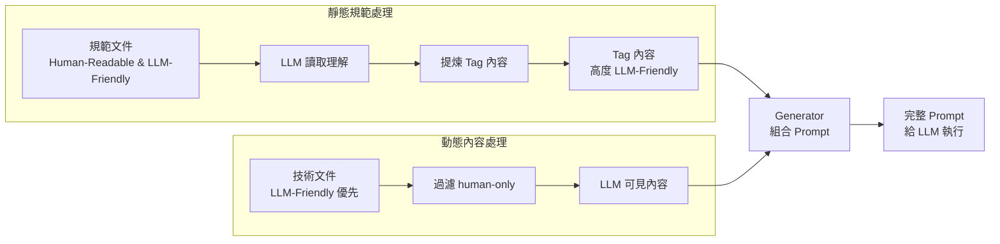
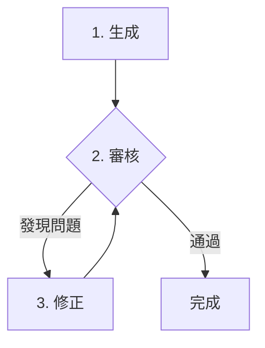
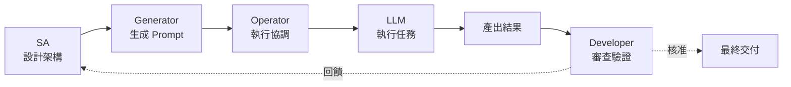
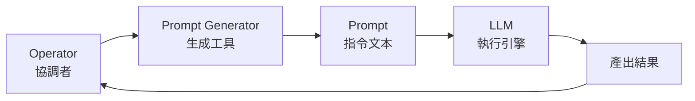

# wBiSaProj 專案設計文件 - 協作篇

## 文件定位與導覽

本文件是 wBiSaProj 專案**協作篇設計文件**，為 [總體設計文件](PROJECT_DESIGN.md) 第四部分的詳細展開。

**文件體系**：

```text
總體設計文件 (PROJECT_DESIGN.md)
    ├── 📘 架構篇 (PROJECT_DESIGN-ARCHITECTURE.md)
    ├── 📗 方法論篇 (PROJECT_DESIGN-METHODOLOGY.md)
    ├── 📙 協作篇 (本文件)
    └── 📕 導航體系篇 (PROJECT_DESIGN-NAVIGATION.md)
```

**本文件結構**：

1. **核心協作理念**：闡述精準協作、品質優先的設計哲學
2. **分層內容架構**：定義動靜態內容的區分與處理策略
3. **Prompt Tag 系統**：實現結構化協作的核心機制
4. **Human-only 過濾機制**：管理人類專屬內容的標記系統
5. **Prompt Generator 架構**：組合靜態規範與動態內容的工具體系
6. **協作角色與流程**：定義人機協作的角色分工
7. **微觀執行流程**：從 Task 到 Action 的詳細執行步驟
8. **標準化介入點**：LLM 在開發流程中的介入時機
9. **實踐指引**：提供決策樹與檢核清單
10. **持續優化機制**：建立協作模式的改進循環

---

## 1. 核心協作理念

本專案採用工程化的 LLM 協作框架，將人機協作從「技藝」提升為「工程」，透過系統化的方法論實現高品質、可維護的協同開發。

### 1.1 設計哲學：精準協作、品質優先

本協作模式的核心是建立一個**系統化、可維護且精準**的框架，讓文件能同時服務於「人類的理解」與「機器的執行」。透過以下三大支柱實現：

1. **內容工程化**：透過分層架構實現人機共存
2. **規範模組化**：透過 Prompt Tag 實現規範重用
3. **流程標準化**：透過 Generator 架構實現任務自動化

---

## 2. 分層內容架構

為解決「如何讓文件同時滿足人類可讀性與 LLM 執行精確性」的核心問題，我們根據文件的使用方式採用不同的內容策略。

### 2.1 動靜態內容定義

| 內容類型 | 定義 | 特徵 | 範例 |
|:---------|:-----|:-----|:-----|
| **靜態規範** | 專案預先定義的規則與標準 | • 跨任務通用<br/>• 不因具體任務改變<br/>• 專案的「憲法」 | coding style、命名規範、文件模板、架構原則、測試模式（如 AAA Pattern） |
| **動態內容** | 任務執行相關的文件與產出 | • 特定於任務<br/>• 隨專案演進<br/>• 專案的「工作產物」 | 既有程式碼、設計文件、測試計畫書、測試結果、資料庫 schema |

**判斷準則**：
- 靜態規範 = 專案預先定義的規則與標準（專案的「憲法」）
- 動態內容 = 任務執行相關的文件與產出（專案的「工作產物」）

**簡易判斷**：
- 會隨著具體功能而不同 → 動態內容
- 適用於所有類似任務 → 靜態規範

### 2.2 常見範例對照

| 文件/內容 | 類型 | 判斷理由 |
|:-----------|:-----|:---------|
| TDD 測試原則 | 靜態規範 | 專案級的測試規則，所有測試都遵循 |
| 測試計畫書 | 動態內容 | 特定功能的測試設計，是任務產出 |
| Git commit 規範 | 靜態規範 | 專案級的提交規則，所有提交都遵循 |
| 設計規格文件 | 動態內容 | 特定功能的設計方案，是任務產出 |
| RESTful API 原則 | 靜態規範 | 專案級的 API 設計原則 |
| API 端點實作 | 動態內容 | 具體的程式碼實作 |

### 2.3 文件撰寫策略

根據文件能否事先標記，採用不同的撰寫與標記策略：

| 文件類型 | 正文撰寫策略 | 標記機制 | 最終 Prompt 內容 |
|:---------|:-------------|:---------|:----------------|
| **靜態規範文件** | Human-Readable **&** LLM-Friendly<br/>（兩者兼顧） | `prompt-tag`：標記供 Prompt 使用的內容<br/>`human-only`：過濾管理性資訊（選用） | 僅包含 Tag 內容 |
| **動態內容文件** | LLM-Friendly 優先 | `human-only`：過濾人類專屬內容 | 包含整份文件（已過濾） |

### 2.4 正反互補的精準投放機制

透過「正向注入」與「反向過濾」的雙向機制，實現精準的內容投放：



**關鍵差異**：
- **靜態規範**：LLM 需要先理解整份文件，才能提煉出最適合的 Tag 內容
- **動態內容**：直接使用整份文件，透過過濾機制排除人類專屬內容

---

## 3. Prompt Tag 系統

Prompt Tag 系統是我們**實踐「結構化文件以利協作」原則的關鍵工具**。它**建立在「文件即程式」的基礎之上**，透過將靜態規範封裝成可重用的邏輯單元，讓我們能夠精準、高效地為 LLM 提供執行任務所需的上下文。

### 3.1 Tag 的設計與執行流程

本系統採用兩階段流程，確保執行的效率與穩定性：

**1. 設計階段 (Design-Time)：提煉與封裝**
在專案開始前的 Prompt Generator Design 階段，由 SA 在 LLM 輔助下，從原始的靜態規範文件中提煉出供 LLM 使用的高度優化規範內容。這些提煉出的內容將被永久性地放置在文件中，並由 `prompt-tag` 區塊包裹。

**2. 執行階段 (Run-Time)：機械式注入**
當開發流程正式開始後，Operator 執行的 Prompt Generator 會根據預設規則，直接、機械地解析並提取指定 `Tag ID` 區塊內的文本，將其作為靜態上下文注入到最終的 Prompt 中。此過程不涉及任何即時的 LLM 理解或分析。

### 3.2 Tag 設計原則

1. **獨立邏輯概念**：每個 Tag 代表一個可獨立使用的規範單元
2. **品質優先**：主要目標是避免不必要的上下文汙染
3. **平衡重用性**：在不造成明顯汙染的前提下，適度整合相關規範

### 3.3 Tag 語法規範

````markdown
```prompt-tag:TAG_ID
[供 LLM 使用的高度優化規範內容]
```
````

**語法說明**：
- 使用 Markdown 標準的 fenced code block（圍欄程式碼區塊）
- Info string 格式為 `prompt-tag:TAG_ID`，其中 `TAG_ID` 為該 Tag 的唯一識別碼
- 區塊內容為供 LLM 使用的高度優化指令文本

### 3.4 Tag 粒度控制

**初始原則**：
- 在一個 prompt 中連續使用的內容可用一個 Tag 包裝
- 根據實際使用模式逐步重構優化

**重構時機**：
- 發現不同 Generator 需要部分重疊的規範時
- 評估汙染程度與維護成本的平衡點

> **範例**：若 `datasource-generator` 和 `business-generator` 都需要日誌規範，但後者多一條「需包含 User ID」的規則。團隊需評估：是建立一個通用的 `logging` Tag 讓 `business-generator` 額外補充指令（可能造成汙染），還是拆分為 `logging-base` 和 `logging-business` 兩個獨立的 Tag（增加維護成本）。

---

## 4. Human-only 過濾機制

Human-only 標記用於在文件中加入人類專屬的內容，這些內容在提供給 LLM 時會被過濾掉。

### 4.1 在靜態文件中的使用

**使用原則**：允許但不鼓勵，僅用於管理性資訊

**適用場景**：
- 歷史決策脈絡（解釋「為什麼」但不影響「是什麼」）
- TODO 或未來規劃（避免未確定內容影響當前規範）
- 團隊內部註記（僅供人類參考的管理資訊）
- 爭議或替代方案（記錄但不希望影響執行）

**不應該用於**：
- 規範內容的人類友善版本（因為正文已經 Human-Readable）

### 4.2 在動態文件中的使用

**使用原則**：積極使用以改善人類可讀性

**適用場景**：
- 人類友善版本（當 LLM 格式難讀時）
- 補充說明與背景資訊
- 團隊討論與決策記錄
- TODO 與注意事項

### 4.3 語法規範

````markdown
```human-only
[僅供人類閱讀的內容]
```
````

**語法說明**：
- 使用 Markdown 標準的 fenced code block（圍欄程式碼區塊）
- Info string 為 `human-only`
- 區塊內容為僅供人類閱讀的補充資訊

**放置位置準則**：
- 提供人類友善版本時 → 放在 LLM 內容**前面**
- 提供補充說明時 → 放在 LLM 內容**後面**

---

## 5. Prompt Generator 架構

Generator 是將靜態規範與動態內容組合成可執行 Prompt 的工具。

### 5.1 Generator 定位

```text
Prompt Generator = Prompt 生成工具
職責：生成一份標準化、高品質的完整 Prompt
輸入：任務類型 + 動態內容 + 所需 Tags
輸出：完整的、可執行的 Prompt
```

**關鍵澄清**：
- Prompt Generator **只負責生成 Prompt**，不執行實際任務
- LLM 才是真正**執行任務**的引擎
- Operator 使用 Generator 生成 Prompt，再將其提交給 LLM

### 5.2 Generator 分類體系

| Generator 類型 | 功能定義 | 典型產出 | 品質保證角色 |
|:---|:---|:---|:---|
| **生成類** | 產生初始內容 | 文件、程式碼 | 起始點 |
| **審核類** | 檢查品質與規範 | 審核報告、違反清單 | 品質檢核 |
| **修正類** | 修正已識別問題 | 修正後內容 | 問題修復 |
| **除錯類** | 解決執行錯誤 | 修正後程式碼 | 錯誤處理 |
| **更新類** | 修改現有內容 | 更新版本 | 需求變更 |
| **重構類** | 優化不改變功能 | 優化後程式碼 | 品質提升 |

### 5.3 文件品質循環 (Document Quality Loop)

在生成規格書、設計文檔等**非程式碼產出**時，遵循一個標準的品質保證流程。此流程的核心是一個**「審核-修正」的迭代循環**。

其流程如下：



**步驟說明**：
1. **生成 (Generate)**：產出文件初稿
2. **進入「審核-修正」循環**：文件在此循環中迭代，直至通過審核
3. **完成 (Complete)**：當文件成功通過一次「審核」後，該 Action 即告完成

### 5.4 程式碼品質保證循環（簡介）

對於**程式碼產出**，則採用一套更嚴謹的品質保證循環。它不僅包含「審核-修正」，還引入了「測試-除錯」子循環，以確保程式碼的功能正確性。

此循環的核心理念是**確保程式碼在任何變更後，都能同時滿足功能正確性（透過測試）與品質規範（透過審核）**。

> 關於此循環的**具體執行步驟與規則**，請參閱後續「微觀執行流程」章節中的詳細說明。

---

## 6. 協作角色與流程

### 6.1 角色定義

| 角色 | 職責 | 關鍵活動 |
|:------|:------|:----------|
| **SA（系統分析師）** | 架構設計者 | • 設計 Prompt Tags<br/>• 定義 Generator 類型<br/>• 劃分任務邊界 |
| **Developer（開發者）** | 品質把關者 | • 提供技術決策<br/>• 審查 LLM 產出<br/>• 執行最終驗證 |
| **Operator（操作者）** | 執行協調者 | • 選擇適當 Generator<br/>• 提供動態內容<br/>• 協調執行流程 |
| **LLM** | 執行引擎 | • 根據 Prompt 執行任務<br/>• 生成符合規範的產出 |

### 6.2 協作流程



---

## 7. 微觀執行流程：從 Task 到 Action

Operator 的核心工作，是根據《方法論篇》為 Task 選擇的測試策略模式（標準 TDD 或探索式驗證），有序地執行一系列**動作 (Action)**。

### 7.1 核心層級定義

| 層級 | 定義 | 範例 |
|:------|:------|:------|
| **Feature** | 完整的業務價值單元 | 使用者註冊功能 |
| **Task** | 對某個 Functional Unit 的操作 | 實作 user repository |
| **Action** | 為完成 Task 中一個步驟而執行的單一動作 | 生成 requirements.md |

### 7.2 Action 的類型與執行方式

**1. 非 LLM Action**：
- 由 Operator 直接執行
- 通常是自動化腳本或手動檢查
- 範例：執行單元測試、提交 Git Commit

**2. LLM 協作 Action**：
此類 Action 需透過人機協作完成，其執行流程如下：



**角色分工**：
- **Prompt Generator**：生成 Prompt 的工廠，組合靜態規範與動態內容
- **LLM**：執行引擎，根據 Prompt 生成實際產出
- **Operator**：協調整個流程，使用 Generator 並提交給 LLM

### 7.3 程式碼品質保證循環 (Code Quality Assurance Loop)

對於所有涉及程式碼產出的實作步驟（無論是標準 TDD 或探索式驗證），都必須執行一個內建的「程式碼品質保證循環」。

**核心原則**：
- 包含兩個子循環：「審核-修正」與「測試-除錯」
- **關鍵規則**：只要其中一個循環引發了程式碼變更，就必須重新執行另一個循環
- 直至程式碼能**依序**通過兩個循環而無需再做任何修改

**執行順序優化**：
根據不同 TDD 步驟的特性，建議採用不同的優先執行順序：

| TDD 步驟 | 優先順序 | 理由 |
|:----------|:---------|:------|
| 測試實作（紅燈） | 審核優先 | 測試邏輯相對簡單，優先確保品質與風格 |
| 功能實作（綠燈） | 測試優先 | 核心是實現功能，優先確保正確性 |
| 重構優化（維持綠燈） | 測試優先 | 不改變外部行為，必須確保測試持續通過 |

### 7.4 標準 TDD 的 Action 序列

#### 情境 A：新增 Functional Unit

**TDD 步驟 1：需求規格制定**
- **Action 1.1 (生成)**：使用生成類 Prompt Generator 建立 Prompt，交由 LLM 產出 requirements.md 初稿
- **Action 1.2 (文件品質循環)**：依序使用審核類及修正類 Prompt Generator，進行品質檢核與修正

**TDD 步驟 2：設計規格制定**
- **Action 2.1 (生成)**：使用對應的生成類 Prompt Generator 產出 design.md
- **Action 2.2 (文件品質循環)**：執行審核與修正

**TDD 步驟 3：測試規格制定**
- **Action 3.1 (生成)**：產出 tests.md
- **Action 3.2 (文件品質循環)**：執行審核與修正

**TDD 步驟 4：測試實作（紅燈）**
- **Action 4.1 (生成)**：產出測試程式碼
- **Action 4.2 (程式碼品質保證循環)**：
  1. **審核-修正循環**（優先）：審核並修正程式碼品質
  2. **測試-除錯循環**：執行測試，確認處於紅燈狀態
  3. **一致性檢查與循環**：若步驟 2 導致變更，必須返回步驟 1 重新執行「審核-修正循環」，以確保品質規範未被破壞。重複此流程，直至程式碼能依序通過兩個循環

**TDD 步驟 5：功能實作（綠燈）**
- **Action 5.1 (生成)**：產出功能程式碼
- **Action 5.2 (程式碼品質保證循環)**：
  1. **測試-除錯循環**（優先）：執行測試，除錯直至通過
  2. **審核-修正循環**：對通過測試的程式碼進行品質改進
  3. **一致性檢查與循環**：若步驟 2 的品質修正導致了程式碼變更，必須返回步驟 1 重新執行「測試-除錯循環」，以確保功能正確性未被破壞。重複此流程，直至程式碼能依序通過兩個循環

**TDD 步驟 6：重構優化（維持綠燈）**
- **Action 6.1 (規劃與執行)**：執行重構相關的 Action
- **Action 6.2 (程式碼品質保證循環)**：
  - 執行流程同步驟 5，優先確保測試通過，再進行品質審核

#### 情境 B：修改現有 Functional Unit

此情境遵循相同的 TDD 步驟，但使用專為「修改」情境設計的 Prompt Generator，並需要準備額外的變更文件（*_changes.md）作為輸入。

### 7.5 探索式驗證的 Action 序列

探索式驗證涉及程式碼的步驟（步驟 6-8），同樣遵循上述品質保證循環與優先順序原則。主要差異在於需要先進行資料探索，再定義驗證規格。

---

## 8. 標準化介入點

LLM 在開發流程中的標準化介入點：

### 8.1 需求階段

- Use Cases 文件撰寫
- 需求完整性審核

### 8.2 設計階段

- 技術規格文件生成
- 設計方案審核

### 8.3 實作階段

- 測試案例設計與實作
- 功能程式碼實作
- 程式碼審查

### 8.4 優化階段

- 程式碼重構
- 效能優化

---

## 9. 實踐指引

### 9.1 文件撰寫決策樹

```text
判斷文件類型：
這是專案級的規則/標準，還是特定任務的文件/產出？
├─ 專案級規則/標準 → 靜態規範文件
│   ├─ 正文：Human-Readable & LLM-Friendly
│   ├─ 使用 prompt-tag 標記 LLM 需要的部分
│   └─ 選用 human-only 過濾管理性資訊
└─ 任務文件/產出 → 動態內容文件
    ├─ 正文：LLM-Friendly 優先
    └─ 使用 human-only 標記人類專屬內容

快速判斷：
• 在專案開始時就能定義 → 靜態規範
• 需要執行任務才能產生 → 動態內容
• 適用於所有同類任務 → 靜態規範
• 隨具體功能而變化 → 動態內容
```

### 9.2 Tag 設計決策樹

```text
新增 Tag 時的思考流程：
1. 這段規範會被哪些 Generator 使用？
2. 不同 Generator 需要的部分是否完全重疊？
   ├─ 是 → 使用單一 Tag
   └─ 否 → 評估汙染程度
        ├─ 汙染可接受 → 使用單一 Tag（維護優先）
        └─ 汙染明顯 → 拆分為多個 Tag（品質優先）
```

### 9.3 Generator 選擇原則

1. **明確任務類型**：根據任務性質選擇對應的 Generator 類型
2. **準備動態內容**：確保所有必要的輸入材料已就緒
3. **組合使用**：複雜任務可組合多個 Generator 形成工作流

### 9.4 Action 執行檢核清單

執行 LLM 協作 Action 時的檢核要點：

- [ ] 確認選擇了正確類型的 Prompt Generator
- [ ] 準備好所有必要的動態內容輸入
- [ ] Generator 成功生成了完整的 Prompt
- [ ] Prompt 已提交給 LLM 並獲得產出
- [ ] 產出已通過初步檢查
- [ ] 若涉及文件，已執行文件品質循環
- [ ] 若涉及程式碼，已執行程式碼品質保證循環
- [ ] 最終結果符合 Task 的預期目標

### 9.5 品質檢核要點

- [ ] 靜態規範文件達到 Human-Readable & LLM-Friendly
- [ ] 動態內容文件達到 LLM-Friendly 優先
- [ ] 所有必要的規範都已轉化為 Prompt Tags
- [ ] human-only 使用符合文件類型的原則
- [ ] Generator 類型與任務需求匹配
- [ ] 執行結果經過 Developer 審查
- [ ] 文件類產出已通過文件品質循環
- [ ] 程式碼類產出已通過程式碼品質保證循環

---

## 10. 持續優化機制

### 10.1 Tag 重構

定期檢視 Tag 使用模式，優化粒度與組織

### 10.2 Generator 優化

根據實際執行效果調整 Generator 設計

### 10.3 流程改進

收集協作過程中的問題，持續改進流程

### 10.4 文件品質提升

根據 LLM 理解效果，優化文件撰寫方式

---

## 總結與後續閱讀

透過這套工程化的人機協作模式，我們將 LLM 轉變為一個**可預測、可控制、高品質**的開發協作夥伴，實現真正的人機協同開發。

**後續閱讀建議**：

| 文件 | 內容重點 | 適合場景 |
|:-----|:---------|:---------|
| [專案架構篇](PROJECT_DESIGN-ARCHITECTURE.md) | 系統架構與技術選型 | 了解系統組織結構 |
| [開發方法論篇](PROJECT_DESIGN-METHODOLOGY.md) | 開發方法論與執行流程 | 掌握開發流程 |
| [架構實作指引](GUIDE_ARCHITECTURE.md) | 具體實作範例與最佳實踐 | 實際開發時參考 |
