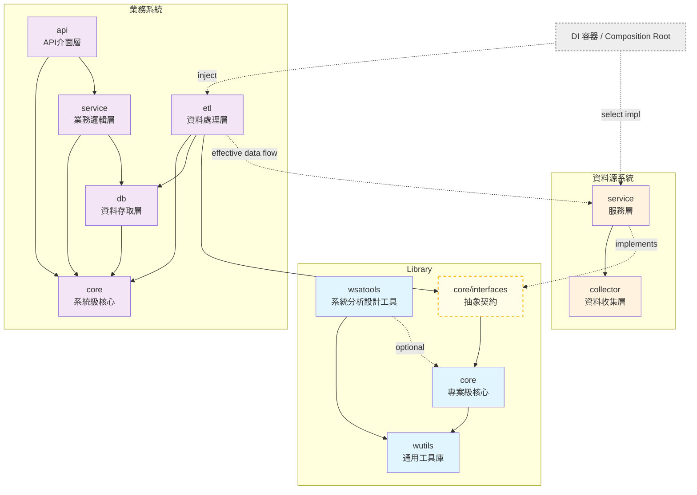

# wBiSaProj 專案總體設計文件 (Master Design Document)

## 專案定位

`wBiSaProj` 本身並非單一系統專案，而是一個系統化開發框架的專案工作空間 (Workspace)。

此工作空間內可以包含多個遵循本設計文件規範的獨立元件，主要分為三大類型：

1. **共用函式庫 (Libraries)**：如 `wutils`, `wsatools`, `core` 等，提供專案級 (Project-level) 的通用功能。
2. **業務系統 (Business Systems)**：為特定業務目的所開發的獨立系統，例如 `gms`。
3. **資料源系統 (Data Source Systems)**：為存取外部數據而建立的適配器系統，例如 `tej`。

---

## 文件定位與導覽

本文件是 wBiSaProj 專案的總體設計文件，旨在提供一個從頂層設計哲學到具體執行框架的完整、一致的視圖。它作為整個專案的核心入口，引導所有參與者理解專案的設計原則與運作模式。

本文件結構如下：

1. **第一部分：總體願景與核心原則**：闡述指導本專案所有決策的三大基石——開發流程、架構設計與人機協作原則。這是理解本專案設計哲學的起點。
2. **第二、三、四部分：核心摘要**：分別摘要說明「系統架構」、「開發方法論」與「人機協作模式」的核心概念，讓讀者能快速掌握全貌。

### 配套詳細文件 (Companion Documents)

為深入了解各主題的完整細節、規範與範例，請參閱以下配套文件：

- [📘 架構篇](PROJECT_DESIGN-ARCHITECTURE.md)：深入探討系統架構、模組職責與設計決策
- [📗 方法論篇](PROJECT_DESIGN-METHODOLOGY.md)：詳述 TDD 開發生命週期、Git 規範與任務模板
- [📙 協作篇](PROJECT_DESIGN-COLLABORATION.md)：提供人機協作的具體操作流程、工具使用與品質保證循環

### 實作指引文件 (Implementation Guides)

- [📘 架構實作指引](GUIDE_ARCHITECTURE.md)：提供架構設計的具體實作範例與最佳實踐

---

## 第一部分：總體願景與核心原則

本專案的核心設計旨在建立一個系統化的開發框架與專案工作空間 (Workspace)。此框架的目標是確保在此空間中開發的每一個獨立系統（包含業務系統、資料源系統與函式庫），都能達到高內聚、低耦合且可長期維護的工程標準。所有架構設計、開發方法與協作模式，均圍繞此一核心目標展開。

### 1.1 開發流程原則 (The "How-to-Build")

採用一個以價值為導向 (Value-Driven)、文件先行 (Document-First) 的結構化開發框架。本框架深度結合了雙軌制的測試策略（包含標準 TDD 與探索式 TDD），確保交付的價值、品質與可追溯性。

其核心由五大支柱構成：

- **價值驅動 (Value-Driven)**：以交付可獨立驗證的 Feature（功能）作為開發的基本單位，確保每次交付都能產生明確的業務或技術價值。

- **文件先行 (Document-First)**：嚴格遵循「先定義 What & Why，後實現 How」的順序。業務需求 (`use-cases`) 與技術規格 (`specs`) 必須在程式碼實作前完成。

- **文件即程式 (Docs-as-Code)**：程式碼的實現必須與技術規格文件保持絕對一致，確保文件的權威性與可執行性，從而保障專案的長期可維護性與知識傳承的可靠性。

- **品質內建 (Quality Built-in)**：以內建於流程的雙軌測試策略（標準 TDD 與探索式驗證）作為品質保證的基礎，透過「紅燈-綠燈-重構」循環等機制從源頭保證品質，而非事後補救。

- **原子化與可追溯性 (Atomicity and Traceability)**：建立清晰的 Git 歷史脈絡，嚴格遵循「一個功能對應一個分支 (Feature ↔ Branch)」、「一個任務對應一個提交 (Task ↔ Commit)」。

### 1.2 架構設計原則 (The "How-to-Organize")

系統的組織結構必須精準映射真實世界的商業邏輯，而非技術實現的便利性。為此，我們的架構設計建立在「組織哲學」與「架構模式」兩大基石之上。

#### 核心組織哲學：以業務驅動結構

此哲學指導我們如何劃分系統與模組的邊界，確保架構與業務對齊。

- **領域驅動 (Domain-Driven)**：系統的模組劃分（`Domain` 與 `Sub-Domain`）必須由真實業務領域的需求驅動，並反映業務本身的邏輯結構。
- **由下而上聚合 (Bottom-up Aggregation)**：系統結構是透過對具體的業務領域進行歸納與組織演化而來，而非由上而下的細分。

#### 關鍵架構模式：以抽象實現解耦

這些模式是實現上述組織哲學、確保系統在技術層面具備高內聚與低耦合特性的具體手段。

- **介面與實作分離 (Interface-Implementation Segregation)**：透過 `FU Container` 的概念，從架構層面強制分離公開介面與私有實作。這是確保模組穩定性與內部重構自由度的基礎。

- **依賴反轉 (Dependency Inversion)**：高層模組不應依賴低層模組的實作，兩者都應依賴於抽象。這是確保系統間（業務系統 vs. 資料源系統）與系統內（跨 Domain 協作）解耦的架構紅線。

- **開閉原則 (Open/Closed Principle)**：系統應對擴充開放，對修改封閉。特別是在擴充資料實體關聯時，應透過反向參考 (Back Reference) 等技術手段，確保新功能不侵入既有的穩定程式碼。

### 1.3 人機協作原則 (The "How-to-Collaborate")

採用工程化的 LLM 協作框架，建立一個系統化、可維護且精準的流程，讓文件能同時服務於「人類的理解」與「機器的執行」。

- **工程化框架 (Engineered Framework)**：將人機協作視為一項系統工程，透過標準化流程（Generators）、角色（SA/Dev/Operator）與產出（文件/程式碼）來管理複雜性。

- **結構化文件以利協作 (Structured Docs for Collaboration)**：對文件內容進行結構化設計（如 `prompt-tag`），使其在服務於人類理解的同時，也能被機器（LLM）精準解析。這是實現高品質、可預測的人機協作的關鍵。

- **品質循環 (Quality Loop)**：在流程中內建「生成-審核-修正」與「測試-除錯」的品質保證循環，確保所有產出（無論是文件或程式碼）都符合專案的最高標準。

---

## 第二部分：專案架構與藍圖

> 本章節為專案核心架構的摘要。關於完整的設計原則、實作範例與具體規範，請參閱 [📘 架構篇設計文件](PROJECT_DESIGN-ARCHITECTURE.md)。

本章節將從「專案工作空間 (Workspace)」的整體藍圖開始，逐步深入到構成此藍圖的各類系統、組織原則，以及最小的程式碼單元規範。

### 2.1 專案架構設計

專案架構在首層共分為三大類型：Library (函式庫)、資料源系統、以及業務/應用系統。這三種類型共同構成了 `wBiSaProj` 專案的基礎。

#### Library (函式庫層)

此層級包含專案共用的 Python 函式庫：

- `wutils`：提供通用的基礎開發工具集。
- `core`：專案級核心套件，提供共用元件與作為系統間解耦契約的抽象介面。
- `wsatools`：提供開發流程所需的輔助工具，不被任何系統依賴。

#### 資料源系統 (Data Source Systems)

此類型系統專責存取並封裝外部資料源，將其轉換為對內提供的標準化唯讀數據服務。其標準兩層架構為：

- `[datasource]/collector` (資料收集層)：負責與外部資料源進行 I/O 操作，獲取最原始的資料。
- `[datasource]/service` (服務層)：負責解析原始資料、進行格式標準化，並實作 `core` 中的統一介面，對外提供穩定的數據服務。

#### 業務/應用系統 (Business/Application Systems)

此類型系統負責實現具體業務功能，其內部由五個標準子模組構成：

- `[system]/core`：系統級核心，封裝該系統內部共用的元件。
- `[system]/etl`：資料處理層，負責執行批次的資料抽取、轉換與載入。
- `[system]/db`：資料存取層，封裝所有資料庫操作。
- `[system]/service`：業務邏輯層，實作核心業務規則。
- `[system]/api`：API 介面層，對外提供 RESTful API 接口。

### 2.2 系統架構依賴關係圖

下圖展示本專案的 Library (函式庫)、資料源系統、以及業務/應用系統間的標準依賴關係，這對於維護系統間的「高內聚、低耦合」至關重要。

**圖 1：wBiSaProj 專案架構依賴關係**



#### 依賴關係說明

本架構的核心是依賴反轉原則 (Dependency Inversion Principle, DIP)。業務系統 (如 `etl` 層) 不直接依賴資料源系統，而是共同依賴定義在專案級 `core` 中的抽象介面。具體的實作在執行時期透過依賴注入 (DI) 進行綁定，從而達成系統間的高度解耦。

> **關鍵理解：依賴反轉的實踐**
>
> - 編譯時：業務系統的 ETL 層只認識 `core/interfaces` 中的抽象介面。
> - 執行時：透過 DI 容器注入具體的資料源系統 (外部數據適配器) 實作。
> - 效果：新增或替換外部資料源時，只需開發新的適配器，而無需修改任何業務系統的程式碼。
> - 架構紅線：任何違反此原則、直接依賴具體資料源系統實作的程式碼，都將破壞系統的解耦設計。

### 2.3 核心組織原則：以業務領域 (Domain) 驅動結構

在了解了專案的整體藍圖與系統間關係後，我們接著探討系統內部的組織哲學。此原則主要應用於「業務/應用系統」與「資料源系統」的結構劃分。

**Domain（業務領域）**：代表系統中一個獨立且完整的業務範疇，如使用者管理（User）、市場分析（Market）等。每個 Domain 封裝了該業務範疇的所有相關功能與資料。

本專案架構的核心，是一個由下而上 (Bottom-up) 的業務領域聚合 (Aggregation) 過程。系統的模組劃分 (`Domain` 與 `Sub-Domain`) 必須由真實業務領域的需求驅動，並反映業務本身的邏輯結構，而非技術實現的便利性。

#### 指導原則

- **業務領域優先**：`Domain` 代表的是「需要管理什麼」的業務範疇（如：`User`），而非「如何實現」的技術概念（如：`identity`）。
- **由具體到抽象**：系統結構是透過歸納具體的業務領域（如 `stock`, `fund`）演化而來，當共通的高階概念（如 `market`）被識別後，才會形成 `Domain` 與 `Sub-Domain` 的層次結構。

#### 結構定義

- `Domain`：一個獨立的業務領域，或是一個聚合了多個相關 `Sub-Domain` 的高階業務概念。
- `Sub-Domain`：隸屬於某個更高階 `Domain` 的具體業務領域。

#### Feature 的歸屬原則

一個 `Feature` 必須歸類到其核心業務價值所屬的 `Domain` 或 `Sub-Domain` 之下，該歸屬定義了 `Feature` 的業務上下文 (Business Context)。而其實作細節 (FUs)，則應遵循高內聚原則，保有其技術上下文 (Technical Context)。

### 2.4 核心架構概念：功能單元 (FU) 與公開容器 (FU Container)

在定義了系統的宏觀組織（Domain）之後，我們現在下探到構成**所有系統（包含 Library）**的最小程式碼組織單元。

本專案所有程式碼，均由功能單元 (FU) 與 FU Container (公開容器) 這兩個基礎概念構成。

- **Functional Unit (FU)**：系統中具有特定職責的最小可測試模組（例如一個函式、類別或元件）。
- **FU Container (公開容器)**：一個 FU 的公開介面所在的 Package。它透過 `__init__.py` 檔案發布 FU，形成外部應當依賴的唯一公開存取路徑。

為確保專案結構的穩定性與可擴展性，我們制定了強制性規範，要求所有實作細節必須私有化，並將 `__init__.py` 作為唯一的公開入口。此設計旨在從架構層面強制實現介面與實作的分離。為精準反映技術概念本身的層次結構，這些容器允許被嵌套，這與業務領域中 Domain/Sub-Domain 的組織方式是相互對應的。

### 2.5 關鍵設計原則與實踐

為確保專案的穩定性、可擴展性與長期可維護性，所有開發活動均需遵循以下關鍵設計原則。這些原則適用於前述的所有系統與程式碼單元。

- **系統間通訊**：業務系統之間僅能透過 API 進行通訊，嚴格禁止直接存取其他系統的資料庫。
- **資料庫策略**：每個業務系統擁有其獨立資料庫，並可根據資料特性混合使用 SQL、NoSQL 與檔案系統儲存。
- **資料存取技術選型**：依據職責分離原則，資料源系統優先使用直接 SQL 以求高效，業務系統 DB 層則使用 ORM/ODM 或 DTO 進行邏輯封裝。
- **命名空間區分**：專案級 `core` 與系統級 `[system]/core` 透過 `import` 路徑明確區分。

#### 依賴反轉原則 (Dependency Inversion Principle, DIP)

此原則是本專案的架構紅線，旨在達成系統間與系統內的高度解耦。高層模組不應依賴低層模組的實作，兩者都應依賴於定義在 `core` 套件中的抽象介面。所有跨 `Domain` 的協作，都必須透過此模式完成。

#### `_imports.py` 混合依賴管理機制

此機制是為了解決 Python 中 `import` 路徑脆弱問題而設計的具體實踐。它透過集中管理依賴，為所有模組提供一個穩定且集中的引用入口，從而提升專案的長期可維護性。

### 2.6 專案檔案結構

最後，以下結構展示了上述所有概念（系統類型、組織原則、核心套件）如何具體映射到專案的檔案目錄中。

所有套件和系統都位於專案根目錄同一層級，三大類型僅為概念分類，不反映在目錄結構中。

#### 檔案結構組織

```text
wBiSaProj/
│
├── wutils/                    # 通用工具庫
│
├── core/                      # 專案級核心套件
│   ├── interfaces/            # 所有跨系統的介面定義
│   ├── schemas/               # 標準化資料模型
│   └── ...
│
├── wsatools/                  # 系統分析設計工具
│
├── datasource/                # 資料源系統（實際會有多個）
│   ├── collector/             # 資料收集層
│   └── service/               # 服務層（實作 core/interfaces）
│
├── businesssys/               # 業務系統（實際會有多個）
│   ├── core/
│   ├── etl/                   # 使用 core/interfaces（透過 DI）
│   ├── db/
│   ├── service/
│   └── api/
│
└── ...
```

#### 命名規範

- 所有系統名稱採用全小寫命名，不使用底線、連字號或駝峰式命名。
- 資料源系統採用標準兩層結構 (`collector`, `service`)。
- 業務系統包含五個標準子模組 (`core`, `etl`, `db`, `service`, `api`)。
- 上述 `datasource` 和 `businesssys` 僅為結構示意用的佔位符，實際系統命名範例如：`gms`、`tej`、`yafin` 等。

#### 介面與實作的檔案位置

- `core/interfaces/`：存放所有跨系統的介面定義。
- `[datasource]/service/`：資料源系統在此實作 `core/interfaces` 中定義的介面。
- `[business]/etl/`：業務系統透過依賴注入（DI）使用這些介面。

### 2.7 核心開發術語定義

為確保溝通一致，我們採用以下術語來描述專案的核心元素：

| 變數 | 定義 | 範例 |
|:-----|:-----|:-----|
| **`<system>`** | 業務系統或資料源系統的名稱 | `gms`, `tej` |
| **`<library>`** | 專案級共用函式庫或系統級內部核心模組 | `core`, `wutils`, `gms/core` |
| **`<toolkit>`** | 函式庫的功能分類，代表技術解決方案集合 | `io`, `ds/tree` |
| **`<domain>`** | 系統的業務領域分類，映射真實世界的業務範疇 | `user`, `market` |
| **`<subdomain>`** | 隸屬於 Domain 之下的具體業務範疇 | `stock`, `profile` |
| **`<feature_name>`** | 業務價值的交付單位名稱 | `pickle-io` |
| **`<fu_path>`** | FU Container 相對於專案根目錄的完整路徑 | `wutils/io`, `gms/db/user` |
| **`<fu_name>`** | 具體功能單元 (FU) 的邏輯名稱 | `pickle-io`, `date-parser` |

---

## 第三部分：開發生命週期與方法論

> 本章節為專案開發方法論的摘要。關於完整的任務模板、TDD 模式與 Git 工作流程細則，請參閱 [📗 方法論篇設計文件](PROJECT_DESIGN-METHODOLOGY.md)。

### 3.1 Feature-Task 二層開發結構

#### Feature 與 FU 的關係

`FU (Functional Unit)` 是從技術實作角度出發的最小結構單元。而在開發流程中，我們以 `Feature` 作為業務價值的交付單位。一個 `Feature` 的實現，通常會涉及對一個或多個 `FU` 的新增或修改。

開發流程圍繞「功能 (Feature)」和「任務 (Task)」兩層結構展開。一個 Feature 代表完整的業務價值單元，由定義需求的「Use Cases Commit」與 N 個實現技術細節的「Task Commit」構成。

```text
Feature（業務價值單元）
├── Use Cases Commit（定義 What & Why）
└── Task Commits（實現 How）
    ├── Task 1: 對 Functional Unit A 的操作
    ├── Task 2: 對 Functional Unit B 的操作
    └── Task N: 對 Functional Unit N 的操作
```

- **Feature**：完整的、可獨立交付的業務價值單元，必須歸屬於一個且僅一個 `Domain`。
- **Task**：對某個特定 Functional Unit 的新增或修改操作。

### 3.2 Feature 分類體系

根據專案架構設計，Feature 分為四大類型，每種類型都有其標準的任務模板，以對應不同的架構層級與職責。

| Feature 類型 | 核心職責 | 對應架構 | 標準 Task 模板 |
|:-------------|:---------|:---------|:---------------|
| Business Feature | 即時業務功能 | 業務系統的 api, service, db 層 | DB → Service → API |
| Library Feature | 開發者工具與共用元件 | Library 層 | 彈性（根據 FU 特性） |
| Data Source Feature | 提供唯讀原始數據 | 資料源系統 | Collector → Service |
| Data Pipeline Feature | 批次資料處理 | 業務系統的 etl 層 | Extractor → Transformer → Loader → Job |

#### 技術型特例

除了標準的垂直功能切片，本方法論也允許交付高價值的純技術元件（如 `DB-only` 或 `Internal Service`）作為 Feature。此類交付的前提是其技術價值明確（如高重用性、隔離不穩定性），且具備最小可驗證性。

### 3.3 Feature 開發生命週期 (1+N 提交結構)

每個 Feature 都遵循一個標準的「1+N」提交生命週期，以確保「文件先行」與「原子化提交」。

#### 階段一：首次提交 (The First Commit)

- **目標**：建立 `feature` 分支後，第一個提交必須是定義功能 What, Why, 以及執行層面的 How 的 `use-cases` 文件。
- **產出**：此提交必須包含完整的 `requirements.md` (業務需求) 與 `design.md` (高階設計與任務分解)，確立整個 Feature 的開發目標與詳細執行計畫。

#### 階段二：後續 N 個提交 (The N Commits)

- **目標**：根據 `use-cases/design.md` 中已經定義好的任務清單，逐步實現功能的技術細節 (How)。
- **產出**：每個 Task 完成後，其規格文件 (`specs`)、測試碼與實作碼會被當作一個原子化的 Commit 提交。

最終，一個完整的 Feature 分支會由一個 `docs` 類型的 `use-cases` 提交，以及 N 個 `Task` 提交所構成，完整記錄了從業務價值到技術實現的全過程。

### 3.4 Task 執行模式：雙軌測試策略

所有 Task 都遵循 TDD 精神，但根據其處理對象的「確定性」與「可控性」，分為兩種執行模式。

#### 測試策略選擇指南

| Task 類型 | 資料來源特性 | 測試策略模式 | 原因 |
|:----------|:-------------|:---------|:-----|
| Collector | 任何外部源 | 探索式驗證 | 結構未知且不可控 |
| Extractor | 外部資料 | 探索式驗證 | 需驗證實際格式 |
| Extractor | 內部 DB | 標準 TDD | 結構已知且可控 |
| Job | 含外部依賴 | 探索式驗證（建議） | 需端到端驗證 |
| 其他 Task | - | 標準 TDD | 邏輯明確可預測 |

- **標準 TDD (Standard TDD)**：適用於內部資料庫、業務邏輯等可控性高的 Task。其流程為「預先定義測試 → 實作 → 重構」。
- **探索式驗證 (Exploratory Validation)**：適用於處理外部網站、第三方 API 等不確定性高的 Task，如 `Collector` 或 `Extractor`。其流程為「探索資料 → 定義驗證 → 測試 → 修正」。

### 3.5 Git 工作流程規範

專案採用標準的 `develop` / `feature` 分支模型，並遵循「一個 Task 對應一個 Commit」的原子化提交原則。

#### 分支策略

- `master`：生產分支
- `develop`：開發主線
- `feature/<root>/<hierarchy...>/<feature-name>`：功能開發分支
  - 採用**階層式命名**，路徑需完整對應 Feature 在 `use-cases` 中的目錄結構（例如：`feature/gms/market/stock/stock-profile`）。

#### 提交格式

所有提交均需遵循 `<type>(<scope>): <subject>` 的格式。

#### Scope 雙軌制

- **`docs` 提交**：`scope` 應為 `use-cases` 的業務分類路徑 (如：`use-cases/gms/market/stock`)。
- **實作提交**：`scope` 應為受影響的功能單元容器路徑 (`<fu_path>`) (如：`gms/api/market/stock/profile`)。

### 3.6 通用品質閘道

> **品質閘道原則**：每個提交都必須通過完整的品質檢查，這不是可選的，而是強制性的架構要求。

在每次提交前，開發者需確保通過以下品質閘道（部分由 commit-hook 自動化）：

1. **依賴管理正確性**: `_imports.py` 依賴宣告已更新且通過驗證。
2. **測試通過**: 所有相關的單元/整合測試必須成功通過。
3. **文件與程式碼一致性**: 最終實作需完整對應 `specs` 技術規格與 `use-cases` 業務目標。

### 3.7 Use Cases 文件組織結構

`use-cases` 的組織結構直接映射了專案的核心組織原則，確保文件與架構的一致性。

#### 組織原則

| 模組類型 | 組織驅動力 | 路徑結構 |
|:---------|:-----------|:---------|
| 系統 (System) | 業務領域驅動 | `docs/use-cases/<system>/[<domain>]/...` |
| 函式庫 (Library) | 功能分類驅動 | `docs/use-cases/<library>/<toolkit>/...` |

#### 文件內容規範

- `requirements.md`：定義 What (業務需求、使用者故事)。
- `design.md`：定義 Why (背景目標) 與 How (高階技術設計、任務分解)。

---

## 第四部分：人機協作與執行細則

> 本章節為專案人機協作模式的摘要。關於完整的執行細則、語法規範與實踐指引，請參閱 [📙 協作篇設計文件](PROJECT_DESIGN-COLLABORATION.md)。

### 4.1 人機協作框架

透過「內容工程化」、「規範模組化」與「流程標準化」三大支柱，實現系統化的人機協作。

#### 分層內容架構：動態內容 vs. 靜態規範

專案中的文件內容，根據其內在特性可分為「靜態規範」與「動態內容」兩種類型。我們正是透過對這兩類文件採用不同的處理策略，來實現兼顧人類可讀性與機器執行精確性的目標：

- **靜態規範 (Static Norms)**：專案預先定義的、跨任務通用的規則與標準，是專案的「憲法」。例如：命名規範、架構原則。
- **動態內容 (Dynamic Content)**：特定於單一任務的文件與產出，是專案的「工作產物」。例如：設計文件、既有程式碼。

#### 精準投放機制：Prompt Tag 與 Human-only

我們在「文件即程式」的基礎上，透過以下互補的標記機制，精準控制 LLM 的資訊輸入：

- **`prompt-tag`**：在靜態規範文件中，用此標籤標記出供 LLM 使用的高度優化規範內容，實現規範的「正向注入」。
- **`human-only`**：在動態內容文件中，用此標籤包裹僅供人類閱讀的補充說明，在交付給 LLM 前會被過濾，實現「反向過濾」。

### 4.2 Prompt Generator 架構

Generator 是將靜態規範（via Tags）與動態內容組合成可執行 Prompt 的自動化工具。

- **定位**：Prompt Generator 只負責生成 Prompt，不執行任務。LLM 才是執行的引擎。

- **分類**：根據功能，Generator 分為六大類型，涵蓋從初始創建到後續維護的完整生命週期：
  - 生成類：產生初始內容。
  - 審核類：檢查品質與規範。
  - 修正類：修正已識別問題。
  - 除錯類：解決執行錯誤。
  - 更新類：修改現有內容。
  - 重構類：優化程式碼，不改變其外部功能。

### 4.3 協作角色與流程

整個協作流程由四個明確定義的角色共同完成：

| 角色 | 核心定位 | 關鍵職責 |
|:-----|:---------|:---------|
| SA | 架構設計者 | 設計 Tags、定義 Generator、劃分任務邊界 |
| Developer | 品質把關者 | 審查產出、技術決策、最終驗證 |
| Operator | 執行協調者 | 選擇 Generator、提供內容、協調流程 |
| LLM | 執行引擎 | 根據 Prompt 執行任務、生成產出 |

### 4.4 微觀執行流程：從 Task 到 Action

Operator 的核心工作，是根據 Task 的 TDD 模式，有序地執行一系列動作 (Action)。一個 Task 由多個 Action 組成。

開發工作的層級關係定義如下：

- **Feature**：一個完整的業務價值單元（例如：使用者註冊功能）。
- **Task**：為實現 Feature 而對某個 Functional Unit 執行的技術操作（例如：實作 user repository）。
- **Action**：為完成 Task 中一個步驟而執行的單一、具體的動作（例如：生成 `requirements.md` 文件）。

### 4.5 品質保證循環

為確保所有產出的品質，流程中內建了兩種品質保證循環。

#### 文件品質循環

針對規格書、設計文檔等非程式碼產出，遵循一個標準的品質保證流程，即在生成初稿後，進入一個『審核-修正』的迭代循環，直至文件通過審核為止。

#### 程式碼品質保證循環

針對程式碼產出，則採用一套更嚴謹的內建循環，確保程式碼在任何變更後，都能同時滿足功能正確性（透過測試）與品質規範（透過審核）。

此循環包含兩個子循環：「測試-除錯」與「審核-修正」。其運作的核心規則是：

> **核心規則**：只要任一子循環（如「審核-修正」）引發了程式碼變更，就必須返回並重新執行另一個子循環（「測試-除錯」），直至程式碼能依序通過兩個循環而無需修改為止。

這個機制確保了程式碼的品質改進不會意外破壞既有功能，反之亦然，從而實現真正健壯的開發過程。
